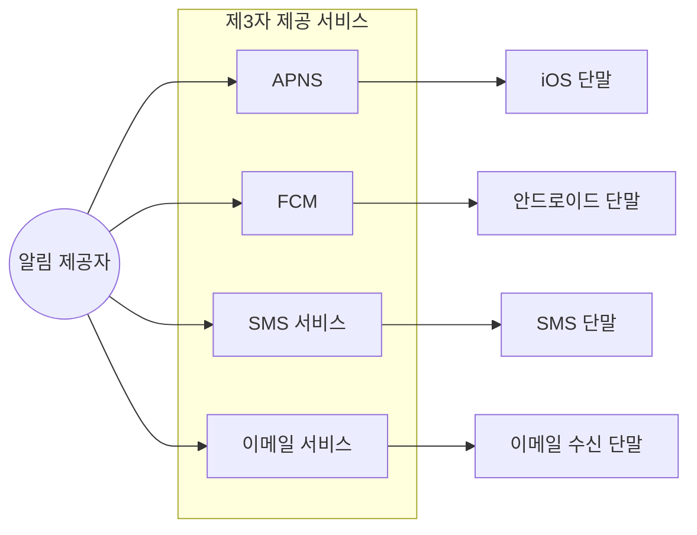
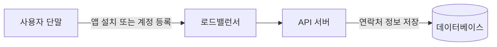
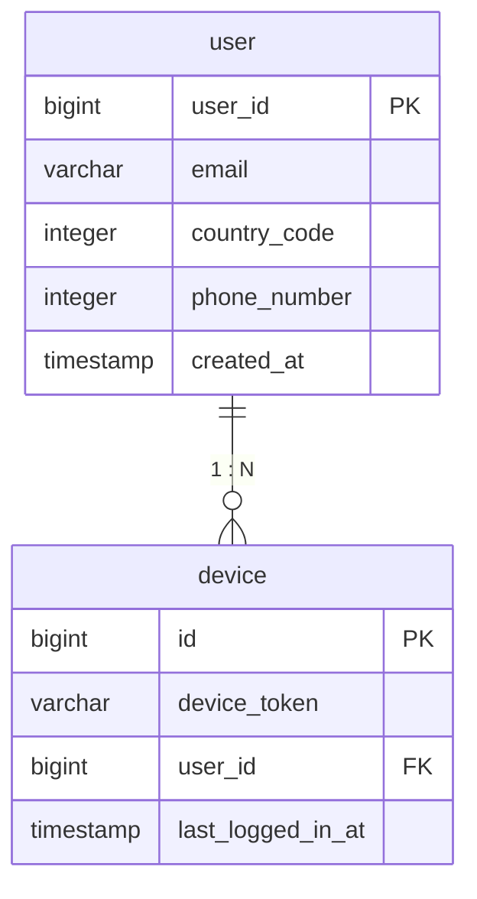
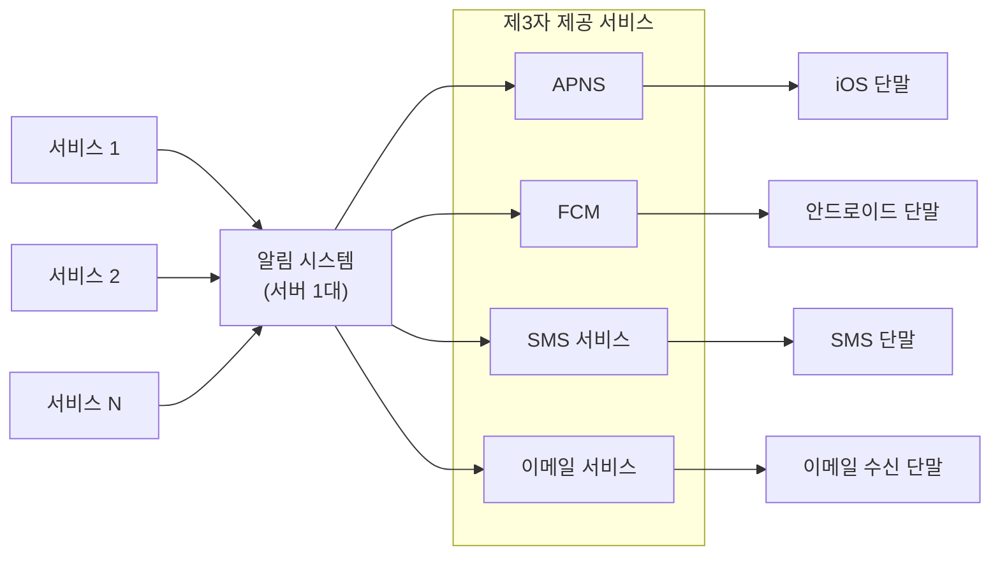
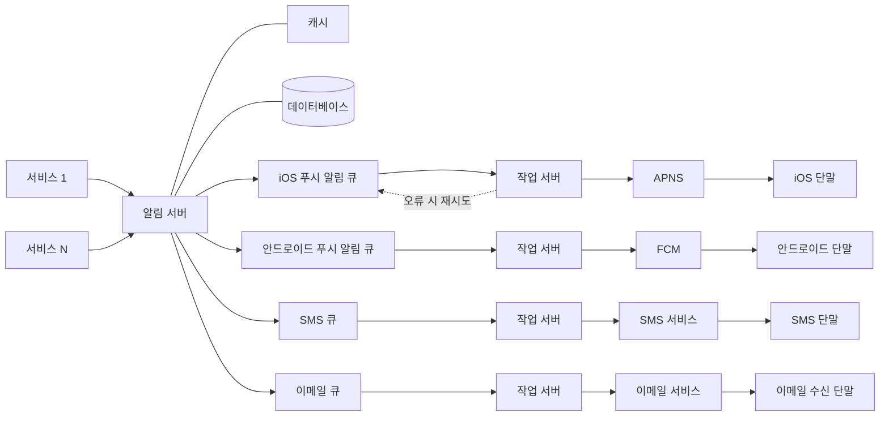
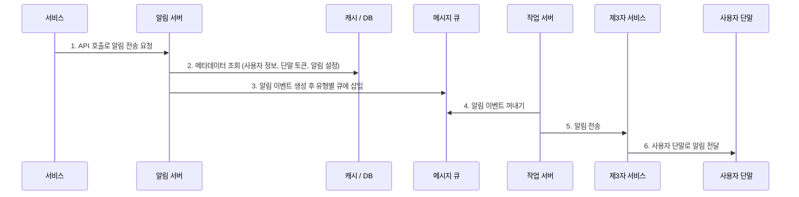
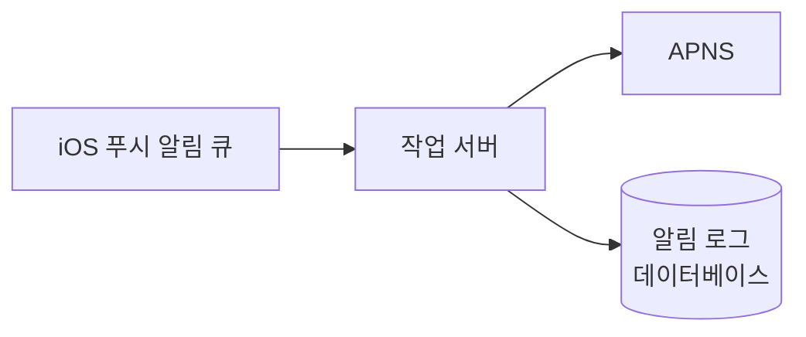
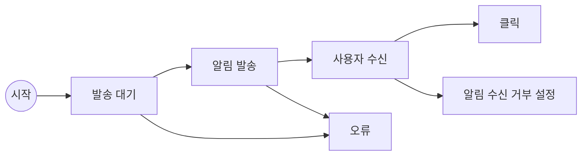
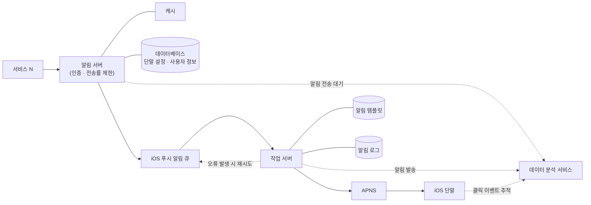

# 10장. 알림 시스템 설계


## 알림 시스템이란?
알림 시스템(notification system): 최신 뉴스, 제품 업데이트, 이벤트 등 고객에게 중요한 정보를 **비동기적**으로 제공하는 기능
  - 모바일 푸시 알림
  - SMS 메시지
  - 이메일

## 1단계: 문제 이해 및 설계 범위 확정

### 요구사항 정리

- **알림 유형:** 푸시 알림, SMS 메시지, 이메일
- **전달 속도:** 연성 실시간(soft real-time). 가능한 한 빨리 전달하되, 높은 부하 시 약간의 지연은 무방
- **지원 단말:** iOS, 안드로이드, 랩톱/데스크톱
- **알림 생성 주체:** 클라이언트 애플리케이션, 또는 서버 측 스케줄링
- **수신 거부(opt-out):** 지원. 설정한 사용자는 알림을 받지 않음
- **일일 전송 규모:** 푸시 1천만 건, SMS 1백만 건, 이메일 5백만 건

## 2단계: 개략적 설계안 제시 및 동의 구하기

### 알림 유형별 지원 방안

#### iOS 푸시 알림

`알림 제공자 → APNS → iOS 단말`

- **알림 제공자(provider):** 알림 요청을 만들어 APNS로 보내는 주체. 

  - 필요한 데이터:
    - **단말 토큰(device token):** 알림 요청에 필요한 고유 식별자
    - **페이로드(payload):** 알림 내용을 담은 JSON 딕셔너리
  ```json
  {
    "aps": {
      "alert": {
        "title": "Game Request",
        "body": "Bob wants to play chess",
        "action-loc-key": "PLAY"
      },
      "badge": 5
    }
  }
  ```

- **APNS(Apple Push Notification Service):** 푸시 알림을 iOS 장치로 보내는 애플의 원격 서비스
- **iOS 단말:** 푸시 알림을 수신하는 사용자 단말

#### 안드로이드 푸시 알림

`알림 제공자 → FCM → 안드로이드 단말`

- 절차는 iOS와 동일, APNS 대신 **FCM(Firebase Cloud Messaging)** 사용

#### SMS 메시지

`알림 제공자 → SMS 서비스 → SMS 수신 단말`

- **트윌리오(Twilio)**, **넥스모(Nexmo)** 같은 제3 사업자 상용 서비스 이용 (유료)

#### 이메일

`알림 제공자 → 이메일 서비스 → 이메일 수신 단말`

- 고유 이메일 서버 대신 **센드그리드(Sendgrid)**, **메일침프(Mailchimp)** 등 상용 서비스를 많이 사용 — 전송 성공률 높고 데이터 분석 서비스 제공

#### 전체 통합 



### 연락처 정보 수집 절차



- 앱 설치 또는 최초 계정 등록 시 API 서버가 단말 토큰, 전화번호, 이메일 주소를 수집해 DB에 저장
- **이메일·전화번호는 user 테이블, 단말 토큰은 device 테이블에 저장**
- 한 사용자가 여러 단말을 가질 수 있고, 알림은 모든 단말에 전송되어야 함 (user 1 : N device)



### 알림 전송 및 수신 절차

#### 개략적 설계안 (초안)



- **서비스 1~N:** 알림을 보내려는 주체. 마이크로서비스, 크론잡, 분산 시스템 컴포넌트 등 (예: 과금 서비스, 쇼핑몰 배송 알림)
- **알림 시스템:** 알림 전송/수신 처리의 핵심. 서비스들에 API를 제공하고, 제3자 서비스에 전달할 페이로드를 생성
- **제3자 서비스:** 사용자에게 알림을 실제 전달. **확장성(extensibility)** 이 중요 — 서비스 통합/제거가 쉬워야 하고, 시장별 가용성도 고려해야 함 (예: FCM은 중국 불가 → 제이푸시(Jpush), 푸시와이(PushY) 사용)
- **단말:** 사용자가 알림을 수신

**초안의 문제점**

- **SPOF(Single-Point-Of-Failure):** 서버가 1대라 장애 시 전체 서비스 중단
- **규모 확장성:** 한 서버가 모든 것을 처리하므로 DB, 캐시 등을 개별적으로 확장할 수 없음
- **성능 병목:** 알림 처리·전송은 자원 소모가 큼(HTML 생성, 제3자 응답 대기 등) → 트래픽 집중 시 과부하

#### 개략적 설계안 (개선된 버전)

개선 방향 3가지
1. 데이터베이스와 캐시를 주 서버에서 **분리**
2. 알림 서버를 증설하고 **자동 수평적 규모 확장**
3. **메시지 큐**로 컴포넌트 간 강한 결합 제거



- **알림 서버:** ① 알림 전송 API(사내/인증된 클라이언트만) ② 알림 검증(이메일·전화번호) ③ DB/캐시 질의 ④ 알림을 메시지 큐에 넣기
- **캐시:** 사용자 정보, 단말 정보, 알림 템플릿 캐시
- **DB:** 사용자, 알림, 설정 등 저장
- **메시지 큐:** 컴포넌트 간 의존성 제거 + 대량 전송 대비 버퍼. **알림 종류별로 별도 큐**를 두어 한 제3자 서비스 장애가 다른 알림 유형에 영향을 주지 않음
- **작업 서버(workers):** 큐에서 알림을 꺼내 제3자 서비스로 전달

**알림 전송 API 예제**

```
POST https://api.example.com/v/sms/send
```

```json
{
  "to": [{ "user_id": 123456 }],
  "from": { "email": "from_address@example.com" },
  "subject": "Hello, World!",
  "content": [{ "type": "text/plain", "value": "Hello, World!" }]
}
```

**알림 전송 흐름 (6단계)**

1. API를 호출하여 알림 서버로 알림을 보낸다
2. 알림 서버는 사용자 정보, 단말 토큰, 알림 설정 같은 메타데이터를 캐시나 DB에서 가져온다
3. 알림 서버는 알림에 맞는 이벤트를 만들어 해당 큐에 넣는다 (iOS 푸시 알림 → iOS 푸시 알림 큐)
4. 작업 서버가 큐에서 알림 이벤트를 꺼낸다
5. 작업 서버가 알림을 제3자 서비스로 보낸다
6. 제3자 서비스가 사용자 단말로 알림을 전송한다



## 3단계: 상세 설계

### 안정성(reliability)

#### 데이터 손실 방지

- 가장 중요한 요구사항: **어떤 상황에서도 알림이 소실되면 안 된다** (지연·순서 변경은 괜찮음)
- 해결책: 알림 데이터를 DB에 보관 + 재시도 메커니즘 → **알림 로그(notification log) 데이터베이스** 유지



#### 알림 중복 전송 방지

- 분산 시스템 특성상 중복 전송을 100% 막는 것은 불가능 [5]
- 빈도를 줄이는 방법: 알림 도착 시 **이벤트 ID를 검사**해 이미 본 이벤트면 버리고, 아니면 발송

### 추가로 필요한 컴포넌트 및 고려사항

#### 알림 템플릿

- 대형 시스템의 알림 대부분은 형식이 비슷 → 인자(parameter)·스타일·추적 링크만 바꿔 쓰는 **틀** 제공
- 효과: 형식의 일관성 유지, 오류 가능성 감소, 알림 작성 시간 절약

> **본문:** [item_name]이 다시 입고되었습니다! [date]까지만 주문 가능합니다!  
> **타이틀(CTA):** 지금 [item_name]을 주문 또는 예약하세요!

#### 알림 설정

- 알림에 피로감을 느끼는 사용자를 위해 채널별 수신 여부를 상세 조정 가능하게 함
- 알림 설정 테이블: `user_id(bigint)`, `channel(varchar — 푸시/이메일/SMS)`, `opt_in(boolean — 수신 여부)`
- 알림 전송 전 반드시 해당 사용자가 그 알림을 켜 두었는지 확인

#### 전송률 제한

- 한 사용자가 받을 수 있는 **알림 빈도를 제한**
- 이유: 알림을 너무 많이 보내면 사용자가 알림 기능을 아예 꺼 버릴 수 있음

#### 재시도 방법

- 제3자 서비스가 전송에 실패하면 해당 알림을 **재시도 전용 큐**에 넣음
- 같은 문제가 계속되면 개발자에게 통지(alert)

#### 푸시 알림과 보안

- 알림 전송 API는 **appKey, appSecret**으로 보안 유지
- 인증된(authenticated)/승인된(verified) 클라이언트만 API로 알림을 보낼 수 있음

#### 큐 모니터링

- 핵심 메트릭: **큐에 쌓인 알림 개수**
- 이 수가 너무 크면 작업 서버가 이벤트를 빠르게 처리하지 못한다는 뜻 → 작업 서버 증설

#### 이벤트 추적

- 알림 확인율, 클릭율, 실제 앱 사용으로 이어지는 비율 등은 사용자 이해에 중요
- 보통 **데이터 분석 서비스(analytics)와 통합**하여 알림 생애주기 이벤트를 추적



### 수정된 설계안



종전 설계안에 다음 컴포넌트가 추가되었다.

- 알림 서버에 **인증(authentication)** 과 **전송률 제한(rate-limiting)** 추가
- **재시도 기능:** 전송 실패한 알림은 다시 큐에 넣고 지정된 횟수만큼 재시도
- **전송 템플릿:** 알림 생성 과정 단순화, 내용 일관성 유지
- **모니터링·추적 시스템:** 시스템 상태 확인 및 추후 개선 용이

## 4단계: 마무리

규모 확장이 쉽고 푸시·SMS·이메일을 모두 지원하는 알림 시스템을 설계했다. 컴포넌트 간 결합도를 낮추기 위해 **메시지 큐**를 적극 사용했다.

- **안정성:** 전송 실패율을 낮추는 재시도 메커니즘 도입
- **보안:** appKey/appSecret으로 인증된 클라이언트만 전송 가능
- **이벤트 추적 및 모니터링:** 알림 생성~전송의 각 단계를 추적·모니터링
- **사용자 설정:** 수신 설정(opt-out)을 확인한 뒤에만 전송
- **전송률 제한:** 사용자별 알림 빈도 제한

## 질문

**Q1. 알림 시스템에서 메시지 큐를 사용하는 이유는?**  
**Q2. 알림이 소실되지 않도록 어떻게 보장하나?**
