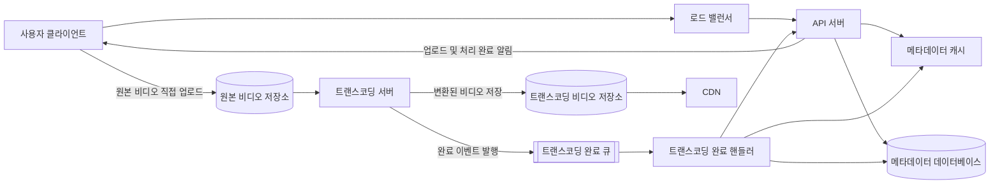
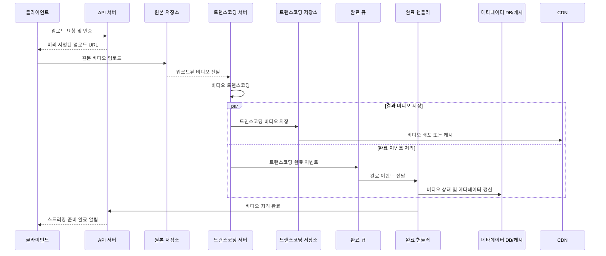
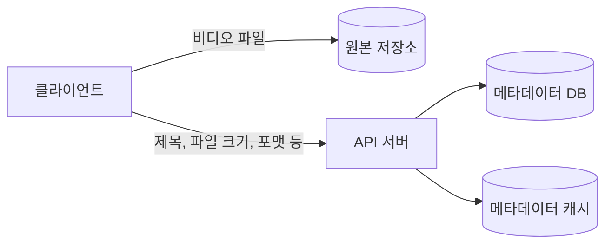
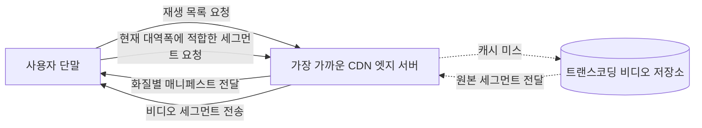
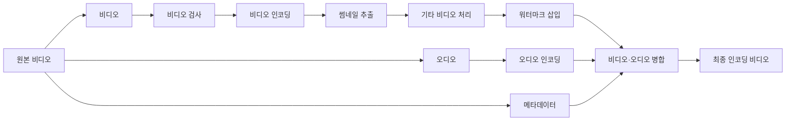
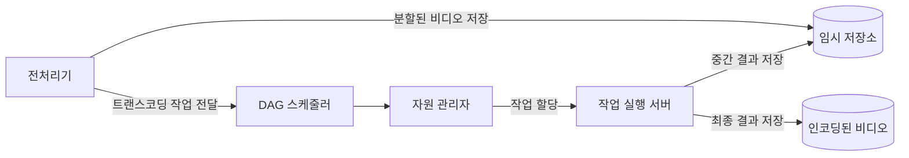
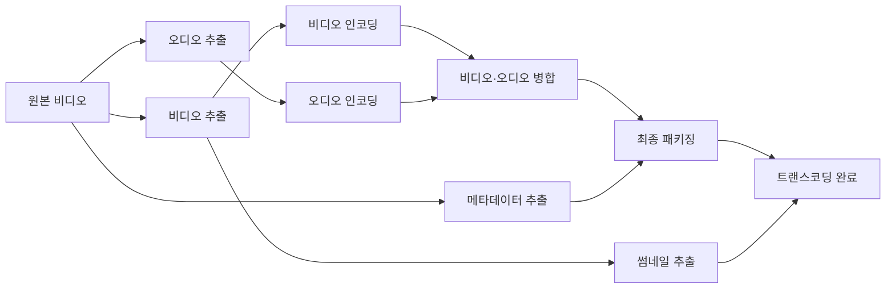
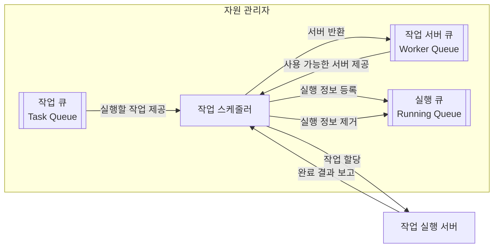
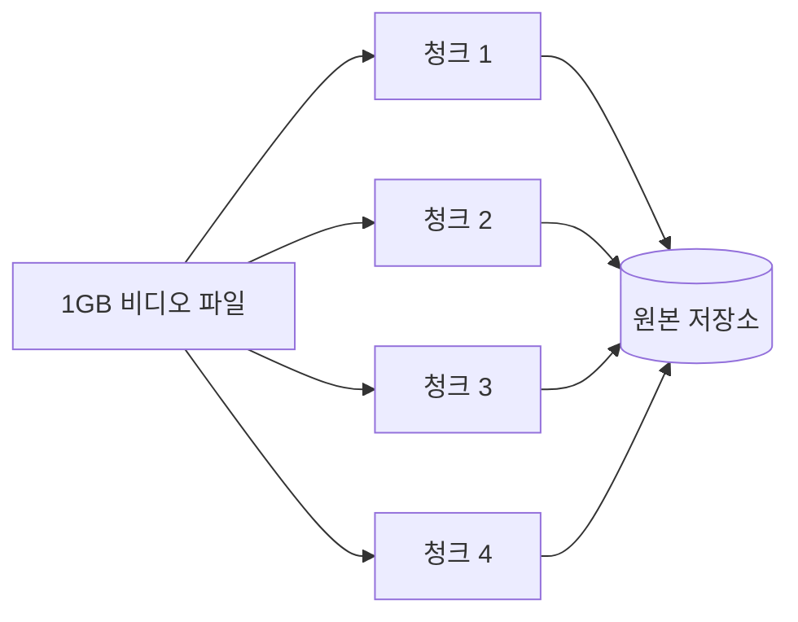
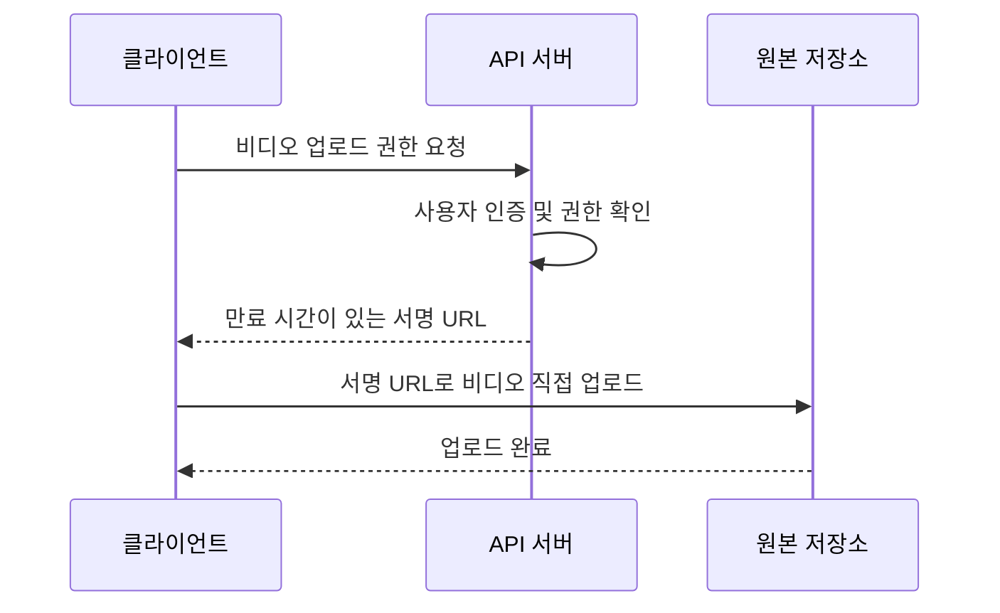

# 14장 유튜브 설계

유튜브와 같은 비디오 스트리밍 서비스는 단순히 비디오 파일을 저장하고 내려주는 시스템이 아니다.

사용자는 다양한 단말에서 비디오를 업로드하고 시청하며, 네트워크 상태에 따라 적절한 화질로 영상을 재생할 수 있어야 한다. 또한 전 세계 사용자에게 안정적으로 서비스를 제공하기 위해 높은 가용성, 확장성, 안정성을 갖춰야 한다.

이번 장에서는 다음 두 가지 핵심 기능을 중심으로 비디오 스트리밍 서비스를 설계한다.

* 비디오 업로드
* 비디오 스트리밍 및 재생

---

## 1. 문제 이해 및 설계 범위 확정

대규모 시스템을 설계할 때는 곧바로 아키텍처를 그리기보다, 먼저 요구사항과 설계 범위를 구체적으로 정의해야 한다.

### 1.1 기능 요구사항

면접관과의 질의응답을 통해 다음과 같은 요구사항을 확정한다.

* 사용자는 비디오를 업로드할 수 있다.
* 사용자는 업로드된 비디오를 시청할 수 있다.
* 모바일 앱, 웹 브라우저, 스마트 TV를 지원한다.
* 다국어를 지원해야 한다.
* 현존하는 대부분의 비디오 포맷과 해상도를 지원해야 한다.
* 사용자는 재생 품질을 선택할 수 있다.
* 비디오는 암호화되어야 한다.
* 비디오 파일 하나의 최대 크기는 1GB다.
* CDN, BLOB 저장소 등 기존 클라우드 서비스를 사용할 수 있다.

이번 설계에서는 댓글, 추천, 광고, 구독, 검색 등 유튜브의 모든 기능을 다루지 않는다.

다음과 같은 비디오 스트리밍 서비스의 핵심 기능에 집중한다.

* 빠른 비디오 업로드
* 원활한 비디오 재생
* 재생 품질 선택
* 낮은 인프라 비용
* 높은 가용성
* 규모 확장성
* 시스템 안정성
* 모바일 앱, 웹 브라우저, 스마트 TV 지원


### 1.2 개략적 규모 추정

시스템의 규모를 파악하기 위해 몇 가지 가정을 세운다.

* 일간 능동 사용자 수: 500만 명
* 사용자 한 명이 하루 평균 시청하는 비디오 수: 5개
* 하루에 비디오를 업로드하는 사용자 비율: 10%
* 평균 비디오 크기: 300MB
* 비디오 한 개의 최대 크기: 1GB

#### 하루 신규 업로드 수

```text
500만 명 × 10%
= 하루 50만 개
```

하루 약 50만 개의 비디오가 새롭게 업로드된다.

#### 하루 신규 저장 용량

```text
500만 명 × 10% × 300MB
= 150TB
```

따라서 비디오 원본만 고려하더라도 매일 약 150TB의 저장 공간이 새롭게 필요하다.

실제로는 하나의 원본 비디오를 여러 해상도와 포맷으로 트랜스코딩하기 때문에, 필요한 저장 공간은 이보다 훨씬 커질 수 있다.

### 1.3 CDN 비용 추정

비디오 스트리밍 서비스에서는 저장 비용뿐 아니라 CDN을 통해 외부로 전송되는 데이터 비용도 매우 중요하다.

책에서는 계산을 단순화하기 위해 다음과 같이 가정한다.

* 사용자 한 명이 하루 평균 비디오 5개를 시청한다.
* 비디오 한 개의 평균 크기는 0.3GB다.
* CDN 전송 비용은 1GB당 0.02달러다.
* 모든 트래픽이 미국에서 발생한다고 가정한다.
* 비디오 스트리밍에 필요한 데이터 전송 비용만 계산한다.

```text
500만 명 × 5개 × 0.3GB × 0.02달러
= 하루 150,000달러
```

하루 비디오 스트리밍 비용만 약 15만 달러가 발생한다.

이는 비디오 스트리밍 서비스에서 CDN 비용이 시스템 전체 비용의 상당 부분을 차지할 수 있다는 점을 보여준다.

따라서 설계 과정에서 저장 비용과 데이터 전송 비용을 함께 최적화해야 한다.

> 위 비용은 책에서 설계를 설명하기 위해 사용한 단순화된 가정이며, 실제 CDN 가격은 리전, 사용량, 계약 조건에 따라 달라질 수 있다.

---

## 2. 개략적 설계안 제시 및 동의 구하기

유튜브와 같은 대규모 시스템의 모든 구성 요소를 직접 개발하는 것은 현실적이지 않다.

특히 다음 구성 요소는 기존 클라우드 서비스를 활용하는 것이 일반적이다.

* CDN
* BLOB 저장소
* 메시지 큐
* 데이터베이스
* 로드 밸런서
* 자동 확장 인프라

이번 설계에서는 비디오 업로드와 비디오 스트리밍을 각각 나누어 살펴본다.


### 2.1 비디오 업로드 절차

#### 사용자

비디오를 업로드하거나 시청하는 서비스 이용자다.

사용자는 모바일 앱, 웹 브라우저, 스마트 TV 등의 클라이언트를 통해 서비스에 접근한다.

#### 로드 밸런서

클라이언트 요청을 여러 API 서버에 고르게 분산한다.

API 서버 일부에 장애가 발생하거나 트래픽이 증가하더라도 요청을 정상적인 서버에 분산해 서비스 가용성을 높인다.

#### API 서버

비디오 파일의 직접적인 스트리밍을 제외한 대부분의 요청을 처리한다.

예를 들면 다음과 같은 요청을 담당한다.

* 사용자 인증
* 비디오 메타데이터 등록
* 업로드 URL 발급
* 비디오 상태 조회
* 비디오 목록 조회
* 업로드 완료 여부 전달

비디오 파일 자체는 크기가 크므로 API 서버를 거치지 않고 BLOB 저장소에 직접 업로드하도록 설계하는 것이 효율적이다.

#### 메타데이터 데이터베이스

비디오와 사용자에 관한 메타데이터를 저장한다.

예를 들면 다음과 같은 정보가 저장된다.

* 비디오 ID
* 제목
* 설명
* 파일 이름
* 파일 크기
* 비디오 포맷
* 업로드 사용자
* 업로드 시각
* 비디오 처리 상태
* 재생 가능한 해상도
* 저장소 경로

성능과 가용성 요구사항을 충족하기 위해 데이터베이스에는 다중화와 샤딩을 적용할 수 있다.

#### 메타데이터 캐시

자주 조회되는 비디오 메타데이터와 사용자 객체를 캐시한다.

비디오 재생 페이지나 목록 화면에서는 동일한 메타데이터가 반복적으로 조회되므로, 캐시를 사용해 데이터베이스 부하와 응답 시간을 줄인다.

#### 원본 저장소

사용자가 업로드한 원본 비디오 파일을 보관하는 대형 BLOB 저장소다.

비디오 파일은 크기가 매우 크기 때문에 일반 관계형 데이터베이스에 저장하지 않고 Amazon S3와 같은 객체 저장소에 보관한다.

#### 트랜스코딩 서버

원본 비디오를 여러 단말과 네트워크 환경에 적합한 형식으로 변환한다.

비디오 트랜스코딩은 비디오 인코딩이라고도 하며, 다음과 같은 작업을 포함한다.

* 비디오 포맷 변환
* 코덱 변환
* 해상도 변환
* 비트레이트 변환
* 오디오 추출 및 변환
* 썸네일 생성
* 워터마크 삽입

트랜스코딩을 통해 모바일, 웹, 스마트 TV 등 서로 다른 환경에 최적화된 비디오 스트림을 제공할 수 있다.

#### 트랜스코딩 비디오 저장소

트랜스코딩이 완료된 비디오 파일을 저장하는 BLOB 저장소다.

원본 비디오 하나로부터 360p, 480p, 720p, 1080p 등 여러 버전의 결과물이 만들어질 수 있다.

#### CDN

트랜스코딩이 완료된 비디오를 사용자와 가까운 엣지 서버에 캐시한다.

사용자가 재생 버튼을 누르면 비디오 스트리밍은 API 서버가 아니라 CDN을 통해 이루어진다.

이를 통해 다음과 같은 효과를 얻을 수 있다.

* 사용자와 가까운 서버에서 비디오 전송
* 재생 지연 감소
* 원본 저장소 부하 감소
* 대규모 트래픽 처리
* 글로벌 사용자 지원

#### 트랜스코딩 완료 큐

비디오 트랜스코딩 완료 이벤트를 보관하는 메시지 큐다.

트랜스코딩 서버와 이후 처리 시스템을 비동기적으로 분리한다.

#### 트랜스코딩 완료 핸들러

트랜스코딩 완료 큐에서 이벤트를 꺼내 후속 작업을 수행하는 작업 서버다.

주요 역할은 다음과 같다.

* 트랜스코딩 완료 상태 반영
* 메타데이터 데이터베이스 갱신
* 메타데이터 캐시 갱신
* 비디오 재생 가능 상태 변경
* 사용자에게 처리 완료 알림


### 비디오 업로드 아키텍처




### 프로세스 A: 비디오 파일 업로드

비디오 파일 업로드와 트랜스코딩 과정은 다음과 같이 진행된다.

#### 1. 원본 비디오 업로드

사용자는 비디오 파일을 원본 저장소에 업로드한다.

대용량 파일이 API 서버를 통과하면 API 서버의 네트워크 대역폭과 자원을 지나치게 사용하게 된다.

따라서 API 서버는 사용자 인증과 업로드 권한을 확인한 뒤, 사용자가 BLOB 저장소로 직접 업로드할 수 있도록 미리 서명된 URL을 발급할 수 있다.

#### 2. 트랜스코딩 시작

트랜스코딩 서버는 원본 저장소에서 업로드된 비디오를 가져온다.

이후 해상도, 코덱, 비트레이트 등의 요구사항에 따라 비디오 변환 작업을 시작한다.

#### 3. 트랜스코딩 완료 후 병렬 처리

트랜스코딩이 완료되면 다음 두 작업을 병렬로 수행한다.

#### 3A. 트랜스코딩된 비디오 저장

완성된 비디오를 트랜스코딩 비디오 저장소에 업로드한다.

이후 트랜스코딩된 비디오는 CDN으로 전달되거나, 사용자의 최초 요청 시 CDN이 원본 저장소에서 가져가도록 구성할 수 있다.

#### 3B. 완료 이벤트 발행

트랜스코딩 완료 이벤트를 메시지 큐에 넣는다.

완료 핸들러는 큐에서 이벤트를 가져와 메타데이터 데이터베이스와 캐시를 갱신한다.

비디오 상태는 다음과 같이 변경될 수 있다.

```text
UPLOADING
→ PROCESSING
→ READY
```

트랜스코딩에 실패한 경우에는 다음과 같은 상태를 둘 수 있다.

```text
FAILED
```

#### 4. 업로드 처리 완료 알림

메타데이터 갱신과 CDN 배포 준비가 완료되면 API 서버가 클라이언트에 비디오 스트리밍 준비가 끝났음을 알린다.

알림 방식은 다음과 같이 구현할 수 있다.

* 클라이언트 폴링
* 웹소켓
* 서버 전송 이벤트
* 모바일 푸시 알림


#### 업로드 처리 순서




### 프로세스 B: 비디오 메타데이터 갱신

비디오 파일이 원본 저장소에 업로드되는 동안, 클라이언트는 비디오 메타데이터를 API 서버에 전달한다.

메타데이터에는 다음과 같은 정보가 포함될 수 있다.

* 파일 이름
* 파일 크기
* 비디오 포맷
* 제목
* 설명
* 카테고리
* 공개 범위
* 언어
* 태그

API 서버는 전달받은 정보를 메타데이터 데이터베이스와 캐시에 저장한다.

파일 업로드와 메타데이터 갱신은 독립적인 작업이므로 병렬로 진행할 수 있다.




## 2.2 비디오 스트리밍 절차

비디오 스트리밍은 비디오 파일 전체를 한 번에 내려받는 방식과 다르다.

클라이언트는 비디오를 작은 단위로 나누어 순차적으로 전달받고, 데이터를 받는 동시에 비디오를 재생한다.

### 스트리밍 프로토콜

스트리밍 프로토콜은 비디오 스트리밍 과정에서 데이터를 전송하기 위해 사용하는 표준화된 통신 방법이다.

대표적인 프로토콜은 다음과 같다.

* MPEG-DASH
* Apple HLS
* Microsoft Smooth Streaming
* Adobe HTTP Dynamic Streaming

### 적응형 비트레이트 스트리밍

하나의 비디오는 여러 해상도와 비트레이트로 트랜스코딩된다.

예를 들면 다음과 같다.

* 360p
* 480p
* 720p
* 1080p
* 4K

플레이어는 현재 네트워크 상태와 단말 성능을 확인해 적절한 품질을 선택한다.

네트워크 상태가 나빠지면 낮은 비트레이트의 비디오를 재생하고, 네트워크 상태가 좋아지면 더 높은 비트레이트의 비디오로 전환한다.

이를 적응형 비트레이트 스트리밍이라고 한다.



비디오 스트리밍은 CDN에서 클라이언트로 직접 이루어진다.

사용자와 가장 가까운 CDN 엣지 서버가 비디오 전송을 담당하므로 지연 시간을 줄일 수 있다.

각 스트리밍 프로토콜은 지원하는 코덱이나 컨테이너 포맷, 플레이어 환경이 다를 수 있다.

따라서 서비스가 지원해야 하는 클라이언트 종류에 따라 적합한 스트리밍 프로토콜과 인코딩 조합을 선택해야 한다.

---

## 3. 상세 설계

### 3.1 비디오 트랜스코딩

비디오 트랜스코딩은 사용자가 업로드한 원본 비디오를 다양한 단말과 네트워크 환경에서 재생 가능한 형태로 변환하는 과정이다.

원본 비디오를 그대로 제공하기 어려운 이유는 다음과 같다.

* 단말마다 지원하는 코덱이 다르다.
* 네트워크 대역폭이 사용자마다 다르다.
* 화면 해상도가 단말마다 다르다.
* 원본 비디오의 용량이 지나치게 클 수 있다.
* 동일한 화질이라도 효율적인 압축 형식이 필요하다.

트랜스코딩 과정에서는 다음 작업을 수행할 수 있다.

* 해상도 변환
* 비트레이트 변환
* 코덱 변환
* 오디오 인코딩
* 비디오 구간 분할
* 썸네일 생성
* 워터마크 삽입
* 메타데이터 추출

예를 들어 4K 원본 비디오 하나가 업로드되면 다음과 같은 결과물이 생성될 수 있다.

```text
4K 원본
├─ 2160p
├─ 1440p
├─ 1080p
├─ 720p
├─ 480p
└─ 360p
```

각 해상도별 결과물은 다시 여러 개의 작은 세그먼트로 나뉜다.


### 3.2 비순환 그래프 모델

비디오 트랜스코딩은 단일 작업이 아니라, 여러 작업이 선후 관계를 가지는 복잡한 처리 과정이다.

예를 들어 썸네일 생성과 오디오 추출은 원본 파일을 기반으로 독립적으로 실행할 수 있다.

반면 특정 해상도의 비디오 패키징은 해당 해상도의 인코딩이 완료된 뒤에 수행해야 한다.

이러한 작업 간 의존성을 표현하기 위해 DAG, 즉 방향성 비순환 그래프 모델을 사용한다.

DAG는 다음 성질을 가진다.

* 작업의 실행 방향이 존재한다.
* 작업 간 의존성을 표현할 수 있다.
* 그래프 안에 순환 구조가 없다.
* 서로 의존하지 않는 작업은 병렬 실행할 수 있다.



DAG 모델을 사용하면 다음과 같은 장점이 있다.

* 비디오 처리 절차를 유연하게 정의할 수 있다.
* 의존성이 없는 작업을 병렬로 처리할 수 있다.
* 특정 작업만 다시 실행할 수 있다.
* 작업별 실패와 재시도를 관리할 수 있다.
* 새로운 인코딩 포맷이나 처리 작업을 쉽게 추가할 수 있다.


### 3.3 비디오 트랜스코딩 아키텍처

비디오 트랜스코딩 시스템은 다음과 같은 주요 컴포넌트로 구성된다.

* 전처리기
* DAG 스케줄러
* 자원 관리자
* 작업 서버
* 임시 저장소
* 인코딩된 비디오 저장소



#### 전처리기

전처리기는 원본 비디오를 검사하고 트랜스코딩에 필요한 기본 정보를 추출한다.

주요 작업은 다음과 같다.

* 원본 비디오를 작은 단위로 분할
* 비디오 메타데이터 추출
* DAG 생성
* 데이터 캐시
* 비디오 손상 여부 검사
* 필요한 인코딩 규격 결정

비디오를 작은 단위로 분할하면 여러 작업 서버가 서로 다른 구간을 병렬로 처리할 수 있다.

#### DAG 스케줄러

DAG 스케줄러는 비디오 처리 작업의 선후 관계를 분석하고, 선행 작업이 완료된 작업만 실행 대상으로 선택한다.



원본 비디오가 입력되면 비디오, 오디오, 메타데이터를 추출하는 작업을 병렬로 실행할 수 있다.

비디오 추출이 완료되면 비디오 인코딩과 썸네일 추출 작업을 실행하고, 오디오 추출이 완료되면 오디오 인코딩 작업을 실행한다.

비디오 인코딩과 오디오 인코딩이 모두 완료되면 두 결과물을 병합한다. 이후 병합된 비디오와 추출된 메타데이터를 이용해 최종 패키징 작업을 수행한다.

썸네일 추출은 비디오·오디오 병합과 직접적인 의존 관계가 없는 별도의 작업이므로 다른 작업과 병렬로 수행할 수 있다.

이처럼 DAG 스케줄러는 각 작업의 의존성을 확인하면서 실행 가능한 작업을 순차적 또는 병렬로 스케줄링한다.

#### 자원 관리자

자원 관리자는 작업 큐, 작업 서버 큐, 실행 큐와 이를 관리하는 작업 스케줄러로 구성된다.



각 큐는 다음 정보를 관리한다.

* **작업 큐**: 실행을 기다리는 트랜스코딩 작업
* **작업 서버 큐**: 현재 작업을 수행할 수 있는 작업 서버
* **실행 큐**: 작업 서버에 할당되어 실행 중인 작업

작업 스케줄러는 작업 큐에서 실행할 작업을 가져오고, 작업 서버 큐에서 사용 가능한 서버를 찾는다. 이후 작업의 CPU, GPU, 메모리 요구 사항과 작업 서버의 가용 자원을 비교하여 적절한 서버를 선택한다.

작업이 서버에 할당되면 작업과 서버의 실행 정보를 실행 큐에 등록한다. 작업이 완료되면 실행 큐에서 해당 정보를 제거하고, 작업 서버를 다시 작업 서버 큐에 등록하여 다음 작업을 수행할 수 있도록 한다.

작업 서버에서 장애가 발생하거나 일정 시간 동안 완료 응답이 오지 않으면 실행 중인 작업을 다시 작업 큐로 돌려 다른 서버에 재할당할 수 있다.

#### 작업 서버

작업 서버는 실제 비디오 처리 작업을 수행한다.

작업 유형별로 서로 다른 서버 풀을 둘 수 있다.

* 비디오 인코딩 작업 서버
* 오디오 인코딩 작업 서버
* 썸네일 생성 작업 서버
* 워터마크 삽입 작업 서버
* 비디오 패키징 작업 서버

작업 서버는 상태를 갖지 않도록 구성하면 필요에 따라 쉽게 확장하거나 축소할 수 있다.

#### 임시 저장소

트랜스코딩 중간 결과물을 저장한다.

예를 들면 다음과 같다.

* 분할된 비디오 조각
* 인코딩 중간 파일
* 추출된 오디오
* 생성된 썸네일
* 패키징 전 세그먼트

임시 데이터는 트랜스코딩 완료 후 삭제할 수 있으므로, 데이터 특성에 따라 적절한 저장소를 선택해야 한다.

#### 인코딩된 비디오 저장소

트랜스코딩이 완료된 최종 비디오를 저장한다.

최종 결과물은 CDN의 원본 저장소 역할을 하며, 이후 사용자에게 스트리밍된다.


### 3.4 시스템 최적화

비디오 스트리밍 시스템에서는 업로드 속도, 처리 속도, 안정성, 비용을 함께 최적화해야 한다.


#### 속도 최적화: 비디오 병렬 업로드

대용량 비디오 파일을 하나의 요청으로 업로드하면 네트워크 오류가 발생했을 때 처음부터 다시 업로드해야 한다.

이를 개선하기 위해 비디오 파일을 작은 조각으로 나누어 병렬 업로드할 수 있다.



병렬 업로드의 장점은 다음과 같다.

* 업로드 시간 단축
* 실패한 조각만 재전송 가능
* 업로드 재개 기능 지원
* 진행률 계산 용이
* 불안정한 모바일 네트워크 대응

다만 동시에 지나치게 많은 조각을 업로드하면 네트워크 혼잡과 저장소 요청 비용이 증가할 수 있으므로 적절한 동시 요청 수를 설정해야 한다.


#### 속도 최적화: 사용자와 가까운 업로드 센터 지정

사용자가 물리적으로 멀리 떨어진 데이터 센터에 비디오를 업로드하면 네트워크 지연이 커질 수 있다.

따라서 사용자 위치와 가까운 업로드 센터나 엣지 네트워크를 선택한다.

예를 들어 한국 사용자는 아시아 리전에, 미국 사용자는 북미 리전에 업로드하도록 구성할 수 있다.

가까운 업로드 센터를 사용하면 다음과 같은 장점이 있다.

* 네트워크 왕복 지연 감소
* 업로드 속도 개선
* 장거리 네트워크 오류 감소
* 사용자 경험 개선

업로드된 원본은 이후 내부 네트워크를 통해 중앙 저장소나 트랜스코딩 리전으로 복제할 수 있다.


#### 속도 최적화: 모든 절차 병렬화

비디오 업로드 이후 발생하는 모든 작업을 순차적으로 처리하면 전체 처리 시간이 길어진다.

예를 들어 다음 작업들은 일정 부분 병렬로 수행할 수 있다.

* 메타데이터 저장
* 원본 비디오 업로드
* 썸네일 생성
* 오디오 추출
* 여러 해상도 인코딩
* CDN 배포 준비
* 콘텐츠 검사

작업 간 의존성이 필요한 경우 메시지 큐와 DAG 스케줄러를 사용해 순서를 제어한다.

메시지 큐를 사용하면 생산자와 소비자를 분리할 수 있으므로 다음과 같은 장점도 얻을 수 있다.

* 느린 작업으로 인한 전체 시스템 지연 방지
* 트래픽 급증 완충
* 작업 서버 독립 확장
* 실패 작업 재처리
* 컴포넌트 간 결합도 감소


#### 안정성 최적화: 미리 서명된 업로드 URL

사용자가 API 서버를 통해 비디오 파일을 업로드하면 대용량 트래픽이 API 서버에 집중된다.

이를 방지하기 위해 API 서버는 사용자 인증과 권한을 확인한 뒤, 원본 저장소에 직접 업로드할 수 있는 미리 서명된 URL을 발급한다.



미리 서명된 URL에는 다음과 같은 제한을 적용할 수 있다.

* URL 만료 시간
* 업로드 가능한 파일 경로
* 최대 파일 크기
* 허용 콘텐츠 타입
* 요청 방식 제한
* 사용자별 업로드 권한

이를 통해 API 서버의 부하를 줄이면서도 안전한 업로드를 제공할 수 있다.


#### 안정성 최적화: 비디오 보호

유료 비디오나 저작권이 있는 콘텐츠는 허가되지 않은 사용자가 임의로 내려받거나 재배포하지 못하도록 보호해야 한다.

비디오 보호를 위해 다음과 같은 방법을 사용할 수 있다.

* 비디오 암호화
* DRM 적용
* 서명된 URL
* 서명된 쿠키
* 짧은 만료 시간의 접근 토큰
* 사용자별 재생 권한 검사
* 워터마크 삽입
* 지역별 재생 제한
* 디바이스별 접근 제한

CDN URL을 단순 공개하면 URL을 알고 있는 사용자가 콘텐츠에 직접 접근할 수 있으므로, 재생 권한을 검증한 사용자에게만 제한된 시간 동안 유효한 접근 권한을 발급해야 한다.


#### 비용 최적화

비디오 서비스에서는 저장소와 CDN 비용이 매우 크기 때문에 비용 최적화가 중요하다.

(1) 인기가 낮은 비디오의 CDN 처리 

모든 비디오를 CDN에 미리 올리면 저장 비용이 증가한다.

따라서 인기가 낮거나 거의 재생되지 않는 비디오는 CDN에 미리 배포하지 않고, 최초 요청 시 원본 저장소에서 가져오도록 할 수 있다.

(2) 인기 비디오 캐시 유지

조회 수가 많은 비디오는 CDN 엣지에 오래 캐시해 원본 저장소 요청과 데이터 전송량을 줄인다.

(3) 오래된 비디오 저장 등급 변경

오랫동안 재생되지 않은 비디오는 더 저렴한 저장소 등급으로 이동할 수 있다.

다만 사용자가 재생을 요청했을 때 복구 시간이 지나치게 길어지지 않도록 접근 빈도에 따라 저장 등급을 결정해야 한다.

(4) 적절한 코덱 사용

압축 효율이 높은 코덱을 사용하면 동일한 화질에서 데이터 크기를 줄일 수 있다.

하지만 코덱에 따라 인코딩 비용이 증가하거나 일부 단말에서 지원되지 않을 수 있으므로, 저장 비용과 호환성, 트랜스코딩 비용 사이의 균형을 고려해야 한다.

(5) 지역별 CDN 전략

트래픽과 사용자 분포가 적은 지역에서는 모든 콘텐츠를 미리 복제하지 않고 요청이 발생할 때 캐시하도록 구성할 수 있다.

(6) 트랜스코딩 결과물 선택

모든 원본 비디오를 모든 코덱과 해상도로 변환하면 비용이 크게 증가한다.

원본 해상도, 예상 시청 단말, 콘텐츠 인기 등을 기준으로 필요한 결과물만 생성할 수 있다.

예를 들어 원본이 720p라면 1080p나 4K 결과물을 생성할 필요가 없다.


### 3.5 오류 처리

대규모 분산 시스템에서 오류를 완전히 방지할 수는 없다.

따라서 오류가 발생했을 때 빠르게 감지하고, 재시도하거나 복구할 수 있는 구조가 필요하다.

#### 복구 가능한 오류

일시적인 네트워크 오류나 작업 서버 장애처럼 재시도로 해결할 수 있는 오류다.

예시는 다음과 같다.

* 원본 저장소 접근 실패
* 네트워크 타임아웃
* 작업 서버 일시 장애
* 메시지 큐 소비 실패
* CDN 업로드 실패

이러한 오류에는 재시도를 적용할 수 있다.

다만 모든 작업을 즉시 무한 재시도하면 장애를 확대할 수 있으므로 다음 전략이 필요하다.

* 최대 재시도 횟수 제한
* 지수 백오프
* 재시도 간 지연
* 작업별 타임아웃
* Dead Letter Queue
* 멱등성 보장

#### 복구 불가능한 오류

잘못된 파일이나 지원하지 않는 포맷처럼 재시도해도 해결되지 않는 오류다.

예시는 다음과 같다.

* 손상된 원본 파일
* 지원하지 않는 비디오 포맷
* 암호화된 원본으로 인한 처리 실패
* 최대 크기를 초과한 파일
* 악성 파일
* 필수 메타데이터 누락

이 경우 작업을 반복하지 않고 실패 상태로 처리한 뒤 사용자에게 다시 업로드하도록 안내해야 한다.

#### 컴포넌트별 오류 처리

(1) 업로드 오류

비디오를 여러 청크로 나누고, 업로드가 실패한 청크만 다시 전송한다.

각 청크에는 체크섬을 두어 데이터가 손상되지 않았는지 확인할 수 있다.

(2) 트랜스코딩 오류

특정 작업이 실패하면 해당 작업만 재실행한다.

DAG 기반으로 작업을 관리하면 전체 트랜스코딩을 처음부터 다시 수행하지 않아도 된다.

(3) 작업 서버 장애

작업 서버의 하트비트를 검사하고, 일정 시간 동안 응답이 없으면 작업을 다른 서버에 재할당한다.

(4) 메시지 중복 처리

메시지 큐에서는 동일한 이벤트가 두 번 이상 전달될 수 있다.

따라서 완료 핸들러는 동일한 이벤트를 여러 번 처리해도 결과가 달라지지 않도록 멱등성을 보장해야 한다.

예를 들어 이벤트 ID나 작업 ID를 저장해 이미 처리한 이벤트인지 확인할 수 있다.

(5) 메타데이터 갱신 오류

트랜스코딩 파일은 저장되었지만 메타데이터 갱신이 실패할 수 있다.

이 경우 이벤트를 재처리하거나, 저장소와 데이터베이스의 상태를 비교하는 정합성 점검 작업을 운영할 수 있다.

(6) CDN 장애

CDN 일부 지역에 장애가 발생하면 다른 엣지나 원본 저장소로 우회할 수 있다.

다중 CDN 전략을 사용해 특정 CDN 제공자의 장애에 대비할 수도 있지만 운영 복잡성과 비용이 증가한다.

---

## 4. 마무리

이번 장에서는 유튜브와 같은 대규모 비디오 스트리밍 서비스를 설계했다.

핵심 설계 포인트는 다음과 같다.

| 문제          | 설계 방안                       |
| ----------- | --------------------------- |
| 대용량 비디오 업로드 | BLOB 저장소 직접 업로드             |
| 느린 업로드      | 청크 단위 병렬 업로드                |
| 다양한 단말 지원   | 비디오 트랜스코딩                   |
| 다양한 네트워크 환경 | 적응형 비트레이트 스트리밍              |
| 글로벌 스트리밍    | CDN                         |
| 긴 처리 시간     | 메시지 큐 기반 비동기 처리             |
| 복잡한 작업 의존성  | DAG 스케줄러                    |
| 높은 트랜스코딩 부하 | 상태 없는 작업 서버 수평 확장           |
| 사용자 접근 제어   | 미리 서명된 URL, 암호화, DRM        |
| 높은 인프라 비용   | CDN 캐시 및 저장 등급 최적화          |
| 작업 실패       | 재시도, 멱등성, Dead Letter Queue |

결국 대규모 비디오 서비스의 핵심은 다음과 같이 정리할 수 있다.

> 대용량 비디오 파일을 안정적으로 업로드하고, 비동기 트랜스코딩을 통해 다양한 형태로 변환한 뒤, CDN을 이용해 전 세계 사용자에게 빠르고 안정적으로 전송하는 것이다.

### 4.1 추가 논의 가능 사항

#### API 계층의 규모 확장성 확보

API 서버는 상태를 갖지 않도록 구성하고 로드 밸런서 뒤에 여러 대를 배치할 수 있다.

트래픽이 증가하면 서버 수를 늘려 수평 확장한다.

사용자 세션은 API 서버 내부가 아닌 Redis나 별도의 인증 토큰에 저장하는 것이 적절하다.

추가로 다음 요소를 고려할 수 있다.

* API Gateway
* 요청 제한
* 사용자별 업로드 횟수 제한
* 인증 및 권한 검사
* 서버 자동 확장
* 장애 서버 제외
* 읽기와 쓰기 API 분리

#### 데이터베이스 계층의 규모 확장성 확보

비디오 메타데이터 조회량이 증가하면 단일 데이터베이스로 처리하기 어렵다.

다음과 같은 방법을 적용할 수 있다.

* 읽기 복제본
* 캐시
* 비디오 ID 기반 샤딩
* 사용자 ID 기반 샤딩
* 읽기와 쓰기 분리
* 비정규화
* 검색 시스템 분리
* 이벤트 기반 집계

샤딩 키를 잘못 선택하면 특정 인기 사용자나 인기 비디오에 요청이 집중될 수 있으므로 데이터 분포를 고려해야 한다.


#### 라이브 스트리밍

라이브 스트리밍은 사전에 업로드된 비디오를 재생하는 주문형 비디오와 요구사항이 다르다.

라이브 스트리밍에서는 특히 낮은 지연 시간이 중요하다.

(1) 스트리밍 프로토콜 선택

일반적인 HLS는 세그먼트 크기와 버퍼링 때문에 지연이 커질 수 있다.

따라서 저지연 HLS, WebRTC 등 낮은 지연을 지원하는 기술을 검토해야 한다.

(2) 병렬화 방식 차이

주문형 비디오는 원본 전체를 확보한 뒤 여러 구간을 나누어 병렬 인코딩할 수 있다.

하지만 라이브 스트리밍은 데이터가 작은 단위로 실시간 유입되므로 전체 비디오를 미리 나누어 처리할 수 없다.

들어오는 데이터를 빠르게 인코딩하고 즉시 전송해야 한다.

(3) 오류 처리 제약

주문형 비디오는 처리 실패 시 일정 시간이 지난 뒤 다시 인코딩해도 된다.

반면 라이브 스트리밍에서는 오류 처리가 오래 걸리면 해당 시점의 방송 데이터를 놓치게 된다.

따라서 빠른 장애 감지, 즉각적인 우회, 짧은 재시도 정책이 필요하다.


#### 비디오 삭제

저작권을 침해하거나 선정적이고 불법적인 콘텐츠는 서비스에서 내려야 한다.

비디오 삭제 대상은 다음 경로를 통해 발견할 수 있다.

* 업로드 과정의 자동 콘텐츠 검사
* 저작권 탐지 시스템
* 머신러닝 기반 유해 콘텐츠 검사
* 사용자 신고
* 운영자 검수
* 권리자의 삭제 요청

비디오를 삭제할 때는 메타데이터만 삭제하는 것으로 충분하지 않다.

다음 위치에 존재하는 데이터를 함께 처리해야 한다.

* 메타데이터 데이터베이스
* 메타데이터 캐시
* 원본 비디오 저장소
* 트랜스코딩 비디오 저장소
* CDN 캐시
* 검색 인덱스
* 추천 시스템
* 재생 목록
* 썸네일 저장소

CDN 캐시가 즉시 제거되지 않으면 삭제된 비디오가 일정 시간 동안 계속 노출될 수 있으므로 캐시 무효화 요청이 필요하다.

다만 신고가 접수되었다는 이유만으로 바로 물리 삭제하면 오판을 복구하기 어렵다.

따라서 다음과 같이 단계적으로 처리할 수 있다.

```text
공개 상태
→ 재생 차단
→ 검수
→ 논리 삭제
→ 보존 기간 경과 후 물리 삭제
```
