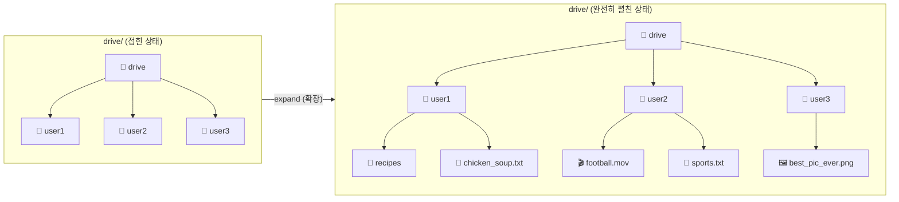
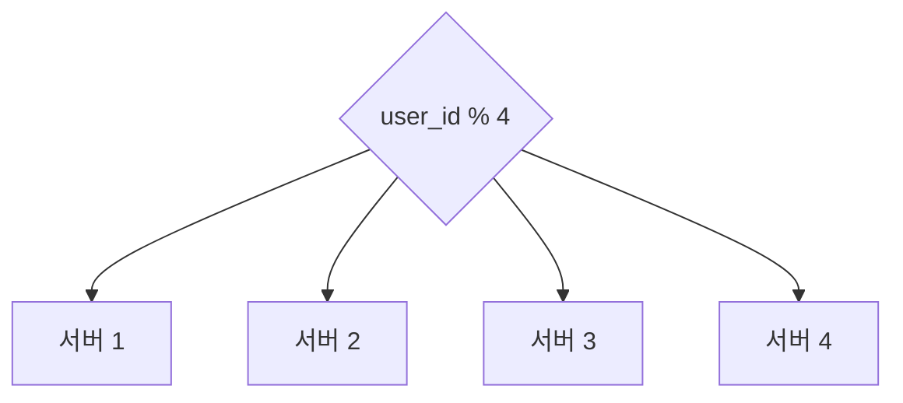
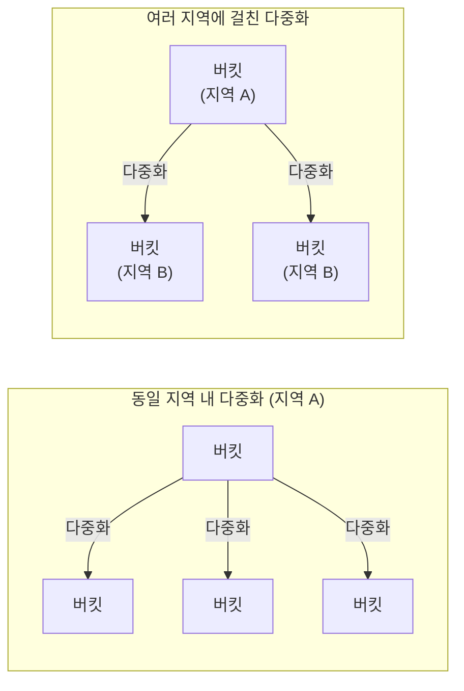
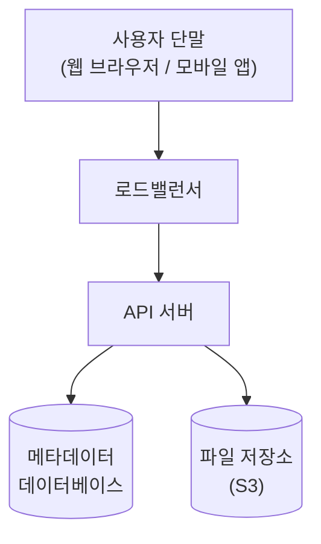
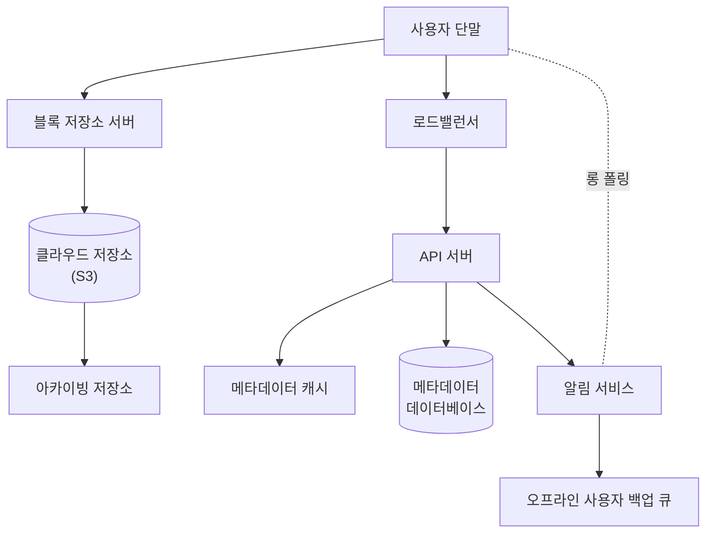
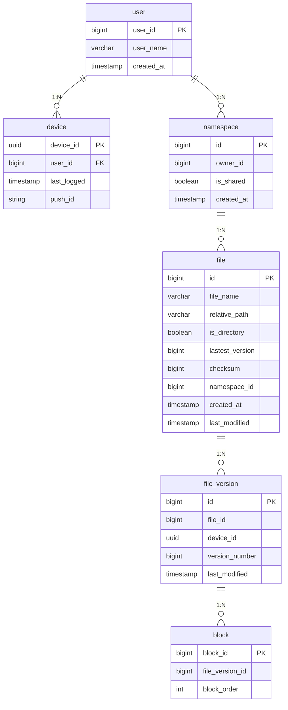
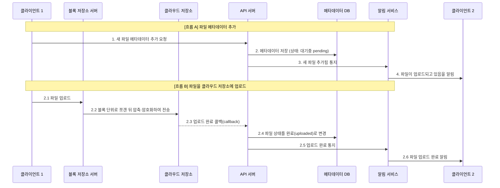
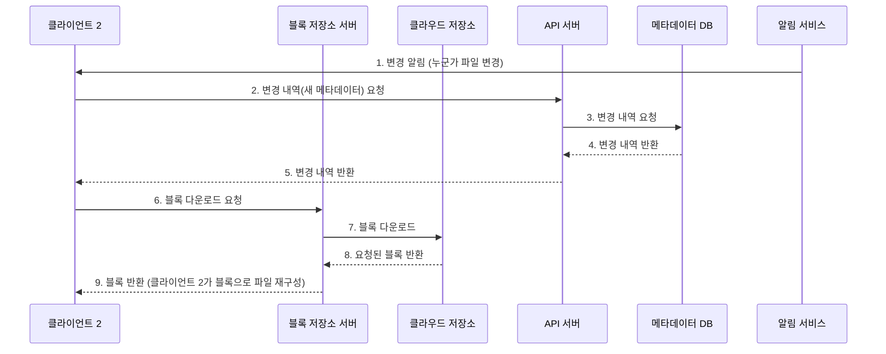
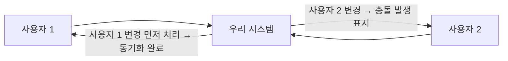

# 15장. 구글 드라이브 설계


## 구글 드라이브란?
구글 드라이브, 드롭박스, 마이크로소프트 원드라이브, 애플 아이클라우드 등의 **클라우드 저장소 서비스**는 최근 높은 인기를 누리는 대표적 클라우드 서비스다.

- **파일 저장 및 동기화 서비스**: 문서, 사진, 비디오 등을 클라우드에 보관
- 컴퓨터, 스마트폰, 태블릿 등 **어떤 단말에서도 이용 가능**해야 함
- 보관된 파일은 친구, 가족, 동료와 **손쉽게 공유** 가능해야 함

## 1단계: 문제 이해 및 설계 범위 확정

### 요구사항 정리 (면접관과의 질의응답)

- **가장 중요한 기능:** 파일 업로드/다운로드, 파일 동기화, 알림
- **지원 단말:** 모바일 앱과 웹 앱 모두 지원
- **파일 암호화:** 저장소 시스템에서 암호화 필요
- **파일 크기 제한:** 10GB
- **사용자 규모:** DAU(일간 능동 사용자) 기준 **천만(10M) 명**

### 설계에 집중할 기능

- **파일 추가:** 가장 쉬운 방법은 파일을 드라이브로 **끌어다 놓기(drag-and-drop)**
- **파일 다운로드**
- **여러 단말에 파일 동기화:** 한 단말에서 추가하면 다른 단말에도 자동 동기화
- **파일 갱신 이력 조회(revision history)**
- **파일 공유**
- 파일이 편집·삭제·공유되었을 때 **알림 표시**

### 설계 범위에서 제외하는 기능

- **구글 문서(Google Doc) 편집 및 협업(collaboration) 기능** — 여러 사용자가 같은 문서를 동시에 편집하는 부분은 제외

### 비-기능적 요구사항

- **안정성(reliability):** 저장소 시스템에서 데이터 손실은 절대 발생하면 안 됨
- **빠른 동기화 속도:** 동기화가 너무 오래 걸리면 사용자가 이탈
- **네트워크 대역폭:** 대역폭을 불필요하게 많이 소모하면 안 됨 (특히 모바일 데이터)
- **규모 확장성:** 아주 많은 양의 트래픽도 처리 가능해야 함
- **높은 가용성:** 일부 서버 장애·지연·네트워크 단절에도 계속 사용 가능해야 함

### 개략적 추정치

| 항목 | 값 |
|------|-----|
| 가입 사용자 | 5천만(50M), DAU 천만(10M) |
| 사용자당 무료 저장공간 | 10GB |
| 일일 업로드 | 사용자당 평균 2개, 파일당 평균 500KB |
| 읽기:쓰기 비율 | 1:1 |
| 필요 저장공간 총량 | 5천만 × 10GB = **500PB(페타바이트)** |
| 업로드 API QPS | 천만 × 2회 / 24시간 / 3600초 = **약 240** |
| 최대 QPS | 240 × 2 = **480** |

## 2단계: 개략적 설계안 제시 및 동의 구하기

> 이번 장은 다이어그램부터 제시하는 대신, **한 대 서버에서 출발**해 점진적으로 천만 사용자 지원 시스템으로 발전시켜 나가는 접근법을 취한다.

### 한 대 서버로 시작

우선 다음 구성의 서버 한 대로 시작한다.

- 파일 업로드/다운로드를 처리할 **웹 서버**
- 사용자 데이터·로그인 정보·파일 정보 등 메타데이터를 보관할 **데이터베이스**
- 파일을 저장할 **저장소 시스템** (파일 저장을 위해 1TB 공간 사용)

**저장 구조:** `drive/` 디렉터리 안에 **네임스페이스(namespace)** 라 불리는 하위 디렉터리들을 둔다. 각 네임스페이스 안에 특정 사용자가 올린 파일이 보관되며, 파일은 원래 파일과 같은 이름을 갖는다. 각 파일·폴더는 **상대 경로를 네임스페이스 이름과 결합**하면 유일하게 식별 가능하다.



### API

기본적으로 세 가지 API가 필요하다. **파일 업로드 API, 다운로드 API, 파일 갱신 히스토리 제공 API**.

#### 1. 파일 업로드 API

두 가지 종류의 업로드를 지원한다.

- **단순 업로드:** 파일 크기가 작을 때 사용
- **이어 올리기(resumable upload):** 파일 크기가 크고 네트워크 문제로 업로드가 중단될 가능성이 높을 때 사용

```
https://api.example.com/files/upload?uploadType=resumable
```
- **인자:** `uploadType=resumable`, `data`(업로드할 로컬 파일)

**이어 올리기 3단계 절차:**
1. 이어 올리기 URL을 받기 위한 최초 요청 전송
2. 데이터를 업로드하고 업로드 상태 모니터링
3. 업로드에 장애가 발생하면 **장애 발생 시점부터** 업로드 재시작

#### 2. 파일 다운로드 API

```
https://api.example.com/files/download
```
- **인자:** `path`(다운로드할 파일 경로)
```json
{ "path": "/recipes/soup/best_soup.txt" }
```

#### 3. 파일 갱신 히스토리 API

```
https://api.example.com/files/list_revisions
```
- **인자:** `path`(파일 경로), `limit`(히스토리 길이 최대치)
```json
{ "path": "/recipes/soup/best_soup.txt", "limit": 20 }
```

> 위 모든 API는 **사용자 인증을 필요로 하고 HTTPS 프로토콜**을 사용해야 한다. SSL을 지원하는 프로토콜을 쓰는 이유는 클라이언트와 백엔드 서버가 주고받는 데이터를 **보호**하기 위해서다.

### 한 대 서버의 제약 극복

업로드되는 파일이 많아지면 결국 파일 시스템은 가득 차게 된다 (예: `10 MB free of 1 TB`). 가장 먼저 떠오르는 해결책은 데이터를 **샤딩(sharding)** 하여 여러 서버에 나누어 저장하는 것 (`user_id` 기준).



하지만 서버 장애 시 데이터 손실 걱정이 여전히 남는다. 그래서 백엔드 전문가에게 물으니 넷플릭스나 에어비앤비 같은 기업들은 저장소로 **아마존 S3**를 사용한다고 한다.

**아마존 S3(Simple Storage Service):** 업계 최고 수준의 규모 확장성·가용성·보안·성능을 제공하는 객체 저장소 서비스. 파일을 S3에 저장하기로 한다.

- S3는 **다중화(replication)** 를 지원 — 같은 지역 안에서, 또는 여러 지역에 걸쳐 가능
- **여러 지역에 걸쳐 다중화**하면 데이터 손실을 막고 가용성을 최대한 보장 → 이 방식 채택
- S3 버킷(bucket)은 파일 시스템의 폴더와 같은 개념



### 개선 방향 (추가로 연구할 부분)

- **로드밸런서:** 네트워크 트래픽을 고르게 분산, 특정 웹 서버 장애 시 자동 우회
- **웹 서버:** 로드밸런서 추가 후 더 많은 웹 서버를 손쉽게 추가 가능 → 트래픽 폭증에도 쉽게 대응
- **메타데이터 데이터베이스:** 파일 저장 서버에서 분리해 **SPOF 회피**. 다중화·샤딩 정책으로 가용성·확장성 요구 대응
- **파일 저장소:** S3를 사용하고 가용성·데이터 무손실을 위해 **두 개 이상 지역에 다중화**

### 개선된 개략적 설계안



## 3단계: 상세 설계

### 개략적 설계안 (전체 컴포넌트)



**핵심 컴포넌트 설명**

- **사용자 단말:** 웹브라우저나 모바일 앱 등의 클라이언트
- **블록 저장소 서버(block server):** 파일 블록을 클라우드 저장소에 업로드하는 서버. **블록 수준 저장소(block-level storage)** 기술을 사용해 파일을 여러 블록으로 나눠 저장하며, 각 블록에는 **고유한 해시값**이 할당된다. 이 해시값은 메타데이터 DB에 저장되고, 각 블록은 독립적 객체로 클라우드 저장소(S3)에 보관된다. 복원하려면 블록들을 **원래 순서대로** 합친다. 한 블록은 드롭박스 사례를 참고해 **최대 4MB**로 정함
- **클라우드 저장소:** 파일은 블록 단위로 나뉘어 보관
- **아카이빙 저장소(cold storage):** 오랫동안 사용되지 않은 비활성(inactive) 데이터를 저장하는 시스템
- **로드밸런서:** 요청을 모든 API 서버에 고르게 분산
- **API 서버:** 파일 업로드 외 거의 모든 것을 담당 — 사용자 인증, 프로파일 관리, 파일 메타데이터 갱신 등
- **메타데이터 데이터베이스:** 사용자·파일·블록·버전 등의 메타데이터를 관리 (**실제 파일은 클라우드에 있고, DB에는 오직 메타데이터만 저장**)
- **메타데이터 캐시:** 자주 쓰이는 메타데이터를 캐시
- **알림 서비스:** 특정 이벤트 발생을 클라이언트에 알리는 **발행/구독(pub/sub) 기반** 시스템. 파일 추가·편집·삭제를 알려 최신 상태 확인
- **오프라인 사용자 백업 큐(offline backup queue):** 클라이언트가 접속 중이 아니라 최신 상태를 확인할 수 없을 때 정보를 큐에 두었다가 나중에 접속하면 동기화

### 블록 저장소 서버

정기적으로 갱신되는 큰 파일을 매번 통째로 서버에 보내면 네트워크 대역폭을 많이 잡아먹는다. 최적화 방법 두 가지:

- **델타 동기화(delta sync):** 파일이 수정되면 전체 파일 대신 **수정이 일어난 블록만** 동기화
- **압축(compression):** 블록 단위로 압축. 압축 알고리즘은 파일 유형에 따라 선택 (텍스트는 gzip/bzip2, 이미지·비디오는 다른 알고리즘)

블록 저장소 서버가 새 파일 처리 시 하는 일:


1. 주어진 파일을 작은 **블록들로 분할**
2. 각 블록을 **압축**
3. 클라우드 저장소로 보내기 전에 **암호화**
4. 클라우드 저장소로 전송

**델타 동기화 예:** 수정된 블록만 클라우드 저장소에 업로드한다. (예: 블록 2와 5만 수정됐다면 두 블록만 업로드)

> 블록 저장소 서버에 델타 동기화 전략과 압축 알고리즘을 도입하여 **네트워크 대역폭 사용량을 절감**할 수 있다.

### 높은 일관성 요구사항

이 시스템은 **강한 일관성(strong consistency)** 모델을 기본 지원해야 한다. 같은 파일이 단말·사용자에 따라 다르게 보이는 것은 허용할 수 없다. 메모리 캐시는 보통 **최종 일관성(eventual consistency)** 을 지원하므로, 강한 일관성을 위해 다음을 보장해야 한다.

- 캐시에 보관된 사본과 데이터베이스에 있는 원본(master)이 일치
- 데이터베이스 원본에 변경이 발생하면 캐시의 사본을 무효화

> 관계형 데이터베이스는 **ACID**(원자성·일관성·격리성·지속성)를 보장하므로 강한 일관성 보장이 쉽다. 반면 NoSQL은 기본 지원하지 않아 동기화 로직에 프로그램으로 넣어야 한다. → 본 설계안은 **관계형 데이터베이스** 채택

### 메타데이터 데이터베이스 (스키마)



- **user:** 이름·이메일·프로파일 사진 등 사용자 기본 정보
- **device:** 단말 정보. `push_id`는 모바일 푸시 알림 송수신용. 한 사용자가 여러 단말을 가질 수 있음
- **namespace:** 사용자의 루트 디렉터리 정보
- **file:** 파일의 최신 정보
- **file_version:** 파일 갱신 이력. 이 테이블 레코드는 전부 **읽기 전용** (갱신 이력 훼손 방지)
- **block:** 파일 블록 정보. 특정 버전 파일은 블록을 **올바른 순서로 조합**하면 복원 가능

### 업로드 절차

두 요청이 **병렬로** 전송된다. 첫째는 파일 메타데이터 추가, 둘째는 파일을 클라우드 저장소에 업로드 (모두 클라이언트 1이 전송).



### 다운로드 절차

파일 다운로드는 파일이 **새로 추가되거나 편집되면 자동 시작**된다. 다른 클라이언트의 변경을 감지하는 두 가지 방법:

- 클라이언트 A가 **접속 중**이고 다른 클라이언트가 파일을 변경 → 알림 서비스가 A에게 "변경 발생, 새 버전을 가져가라" 고 알림
- 클라이언트 A가 **접속 중이 아님** → 데이터를 캐시에 보관, A가 접속 상태로 바뀌면 새 버전을 가져감



### 알림 서비스

파일 일관성 유지를 위해, 클라이언트는 로컬에서 파일이 수정됨을 감지하는 순간 다른 클라이언트에 알려 **충돌 가능성을 줄여야** 한다. 두 가지 선택지:

- **롱 폴링(long polling):** 드롭박스가 채택한 방식
- **웹소켓(WebSocket):** 클라이언트-서버 간 지속적 양방향 통신 채널 제공

**본 설계안은 롱 폴링을 사용** — 이유:
- 채팅 서비스와 달리 **양방향 통신이 필요 없음** (서버 → 클라이언트 단방향 통지만 필요)
- 웹소켓은 실시간 양방향 통신(채팅 등)에 적합. 구글 드라이브는 알림이 자주 발생하지 않고 단시간에 많은 데이터를 보낼 일도 없음

**동작:** 각 클라이언트는 알림 서버와 롱 폴링 연결을 유지하다가, 특정 파일 변경이 감지되면 연결을 끊는다. 그 후 반드시 메타데이터 서버와 연결해 최신 내역을 다운로드한다. 다운로드가 끝나거나 연결 타임아웃에 도달하면 **즉시 새 요청을 보내 롱 폴링 연결을 복원·유지**한다.

### 동기화 충돌

두 명 이상이 같은 파일/폴더를 동시에 수정하면 충돌이 발생한다. **해소 전략:**

- **먼저 처리되는 변경**은 성공한 것으로 보고, **나중에 처리되는 변경**은 충돌이 발생한 것으로 표시

충돌 발생 시 같은 파일의 두 버전이 존재한다 — 사용자 2의 로컬 사본과 서버의 최신 버전. 시스템은 충돌 파일을 별도로 만들어 준다 (예: `SystemDesignInterview_user2_conflicted_copy_2019-05-01`). 사용자는 두 파일을 **하나로 합치거나** 둘 중 하나로 대체할지 결정한다.



### 저장소 공간 절약

파일 갱신 이력 보존·안정성을 위해 여러 버전을 여러 데이터센터에 보관해야 하는데, 모든 버전을 자주 백업하면 저장 용량이 빠르게 소진된다. 비용 절감 방법:

- **중복 제거(de-dupe):** 중복된 파일 블록을 계정 차원에서 제거. 두 블록이 같은지는 **해시값을 비교**해 판단
- **지능적 백업 전략:**
  - **한도 설정:** 보관 버전 개수에 상한을 두고, 상한 도달 시 가장 오래된 버전 삭제
  - **중요한 버전만 보관:** 자주 바뀌는 파일(예: 편집 중 문서)은 짧은 시간에 1000개 넘는 버전이 생길 수 있으므로 중요한 것만 선별
- **아카이빙 저장소(cold storage) 활용:** 몇 달~수년간 이용되지 않는 데이터는 이동. 아마존 S3 글래시어(Glacier) 같은 아카이빙 이용료는 S3보다 훨씬 저렴

### 장애 처리

대규모 시스템에서 장애는 피할 수 없다. 면접관이 관심 가질 만한 장애 유형:

- **로드밸런서 장애:** 부(secondary) 로드밸런서가 활성화되어 트래픽을 이어받음. 로드밸런서끼리는 보통 **박동(heartbeat) 신호**로 상태 모니터링, 일정 시간 응답 없으면 장애로 간주
- **블록 저장소 서버 장애:** 다른 서버가 미완료/대기 상태 작업을 이어받음
- **클라우드 저장소 장애:** S3 버킷을 여러 지역에 다중화했으므로 다른 지역에서 파일을 가져오면 됨
- **API 서버 장애:** API 서버는 **무상태(stateless)** 이므로, 로드밸런서가 트래픽을 장애 서버로 보내지 않음으로써 격리
- **메타데이터 캐시 장애:** 캐시 서버도 다중화. 한 노드 장애 시 다른 노드에서 데이터 획득, 장애 서버는 새 서버로 교체
- **메타데이터 DB 장애:**
  - **주(master) DB 장애:** 부(secondary) DB 중 하나를 주 DB로 승격하고, 부 DB를 새로 추가
  - **부 DB 장애:** 다른 부 DB가 읽기 연산을 처리하도록 하고 장애 서버는 교체
- **알림 서비스 장애:** 접속 중 모든 사용자는 알림 서버와 롱 폴링 연결을 하나씩 유지. 2012년 드롭박스 발표자료에 따르면 **한 대의 알림 서버가 관리하는 연결 수는 100만 개 이상**. 서버 장애 시 100만 명 이상이 롱 폴링 연결을 다시 만들어야 하는데, 한 서버로 100만 접속을 **유지**하는 것은 가능해도 동시에 **시작(복원)** 하는 것은 불가능하므로 연결 복구는 상대적으로 느릴 수 있음
- **오프라인 사용자 백업 큐 장애:** 큐도 다중화. 장애 시 구독 중인 클라이언트들이 백업 큐로 구독 관계를 재설정

## 4단계: 마무리

높은 수준의 일관성, 낮은 네트워크 지연, 빠른 동기화가 요구되는 구글 드라이브 시스템을 설계했다. 설계안은 크게 **두 부분**으로 구성된다.

- **파일 메타데이터를 관리하는 부분**
- **파일 동기화를 처리하는 부분**
- **알림 서비스**는 두 부분과 병존하는 또 하나의 중요 컴포넌트로, **롱 폴링**을 사용해 클라이언트가 파일 상태를 최신으로 유지하도록 한다.

### 대안 논의: 블록 저장소 서버를 거치지 않고 클라우드에 직접 업로드

- **장점:** 파일 전송을 클라우드 저장소로 직접 하므로 업로드 시간이 빨라질 수 있음
- **단점:**
  - 분할·압축·암호화 로직을 **클라이언트에 두어야** 하므로 플랫폼별(iOS, 안드로이드, 웹)로 따로 구현해야 함
  - 클라이언트가 **해킹당할 가능성**이 있어 암호화 로직을 클라이언트에 두는 것은 부적절할 수 있음
- **또 다른 개선:** 접속상태를 관리하는 로직을 **별도 서비스로 분리**하면 다른 서비스에서도 쉽게 활용 가능

## 질문

Q1. 델타 동기화(delta sync)와 압축이 각각 어떤 문제를 해결하는가?   
Q2. 강한 일관성을 위해 캐시와 DB 사이에 무엇을 보장해야 하는가?
