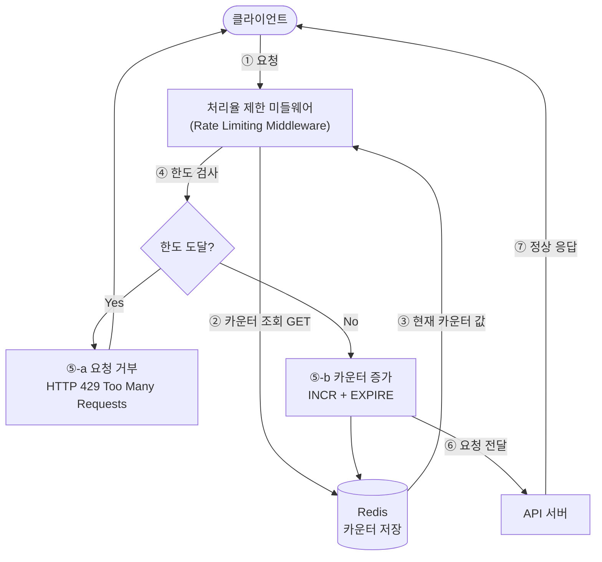

# 4장. 처리율 제한 장치의 설계

> **한 줄 요약**: 처리율 제한 장치(rate limiter)는 클라이언트/서비스가 보내는 트래픽의 처리율을 임계치 기준으로 제어하는 장치다. 임계치를 넘는 요청은 차단(block)된다.


## 처리율 제한 장치란?

네트워크 시스템에서 **처리율 제한 장치(rate limiter)** 는 클라이언트 또는 서비스가 보내는 트래픽의 처리율(rate)을 제어하기 위한 장치다. 임계치(threshold)를 넘는 추가 요청은 차단된다.

**예시**
- 초당 2회 이상 새 글 작성 불가
- 같은 IP로 하루 10개 이상 계정 생성 불가

### 왜 필요한가
처리율 제한 장치는 다음 목적을 가진다.
- DoS 공격이나 과도한 요청으로 인한 자원 고갈 방지
- 불필요한 요청 차단으로 서버 비용 절감
- 트래픽 급증으로부터 서비스 보호
- API 사용자에게 공정한 사용량 제한 제공


## 1단계: 문제 이해 및 설계 범위 확정

**면접 대화에서 확정된 전제**
- 서버 측 API용 제한 장치
- 다양한 제어 규칙(throttling rules)을 정의할 수 있는 **유연한** 시스템
- **대규모** 요청 처리, **분산 환경**에서 동작
- 독립 서비스/애플리케이션 코드 포함 여부는 자유 선택
- 제한된 사용자에게 그 사실을 **알려야 함**

**요구사항**
- 설정된 처리율 초과 요청을 정확히 제한
- 낮은 응답시간 (HTTP 응답에 악영향 X)
- 적은 메모리 사용
- 분산 처리 제한 (여러 서버/프로세스가 공유)
- 예외 처리 (제한 사실을 사용자에게 표시)
- 높은 결함 감내성 (제한 장치 장애가 전체 시스템에 영향 X)


## 2단계: 개략적 설계 — 어디에 둘 것인가?

| 위치 | 특징 |
|---|---|
| **클라이언트 측** | 요청 위변조 쉽고 구현 통제 어려움 → 안정적이지 않아 **부적합** |
| **서버 측** | API 서버에 직접 두거나 **미들웨어**로 분리. 차단 시 **HTTP 429 (Too many requests)** 반환 |
| **API 게이트웨이** | 클라우드 마이크로서비스에서 일반적. 처리율 제한 + SSL 종단 + 인증 + IP 허용목록 등을 지원하는 **완전 위탁관리형 서비스** |

고려 사항
- 사용 언어가 서버 측 구현에 충분히 효율적인지 확인
- 사업 필요에 맞는 알고리즘 선택 (게이트웨이 사용 시 선택지 제한될 수 있음)
- 이미 마이크로서비스 + API 게이트웨이 구조라면 게이트웨이에 포함
- 인력 부족 시 상용 API 게이트웨이 사용이 유리

## 처리율 제한 알고리즘

다섯 가지 핵심 알고리즘을 비교한다.

### ① 토큰 버킷 (Token Bucket)
> **아마존, 스트라이프** 사용. 가장 널리 쓰임.

- 지정 용량의 버킷에 **토큰이 주기적으로 공급**됨 (꽉 차면 overflow 버려짐)
- 요청마다 토큰 1개 소비. 토큰 있으면 통과, 없으면 요청 버림(dropped)
  

- **파라미터**: 버킷 크기, 토큰 공급률(refill rate)
- **버킷 개수**: 보통 엔드포인트마다(예: 포스팅/친구추가/좋아요 = 3개), IP별, 또는 전역 1개(초당 10,000 요청 제한 등) 


- 장점) 구현 쉽고 메모리 효율적, **버스트 트래픽 처리 가능**
- 단점) 버킷 크기·공급률 두 파라미터 튜닝이 까다로움

### ② 누출 버킷 (Leaky Bucket)
> **쇼피파이** 사용. **FIFO 큐**로 구현.

- 요청 도착 시 큐에 자리 있으면 추가, 가득 차면 버림
- **지정된 시간마다 고정 처리율로** 큐에서 꺼내 처리


- **파라미터**: 버킷 크기(=큐 크기), 처리율(outflow rate)


- 장점) 메모리 효율적, **안정적 출력(stable outflow)** 이 필요할 때 적합
- 단점) 버스트 시 오래된 요청이 쌓여 최신 요청이 버려질 수 있음, 튜닝 까다로움

### ③ 고정 윈도 카운터 (Fixed Window Counter)
- 타임라인을 고정 간격 윈도로 나누고 윈도마다 카운터 부여, 요청마다 +1
- 카운터가 임계치 도달 시 새 윈도가 열릴 때까지 요청 거부


- ⚠️ **경계 부근 버스트 문제**: 분당 5개 제한에서 2:00:30~2:01:30 구간을 보면 최대 10개(한도 2배) 통과 가능


- 장점) 메모리 효율적, 이해 쉬움
- 단점) 윈도 경계에서 한도 초과 처리 발생

### ④ 이동 윈도 로그 (Sliding Window Log)
- 고정 윈도의 경계 문제를 해결
- 요청 **타임스탬프**를 추적 (보통 **Redis 정렬 집합(sorted set)** 에 보관)
- 새 요청 시 만료된 타임스탬프 제거 → 새 타임스탬프 추가 → 로그 크기가 한도 이하면 허용, 초과면 거부 (거부돼도 타임스탬프는 남음)


- 장점) 어느 순간을 보더라도 한도를 넘지 않는 **정교한** 메커니즘
- 단점) 거부된 요청 타임스탬프까지 보관 → **메모리 많이 사용**

### ⑤ 이동 윈도 카운터 (Sliding Window Counter)
- 고정 윈도 + 이동 윈도 로그를 **결합**
- 공식: `현재 윈도 요청 수 + 직전 윈도 요청 수 × 겹치는 비율`
- 예) 한도 7/분, 직전 5개·현재 3개, 30% 경과 시점 → `3 + 5×70% = 6.5 → 내림 6개` → 허용


- 장점) 버스트에 잘 대응, 메모리 효율적
- 단점) 직전 트래픽이 균등 분포라 가정 → 다소 느슨. 단 **클라우드플레어 실험상 40억 요청 중 오차 0.003%**

### 알고리즘 한눈에 비교

| 알고리즘 | 버스트 대응 | 메모리 | 정확도 | 대표 사용처 |
|---|---|---|---|---|
| 토큰 버킷 | ✅ 좋음 | 효율적 | 보통 | 아마존, 스트라이프 |
| 누출 버킷 | ❌ (고정 출력) | 효율적 | 보통 | 쇼피파이 |
| 고정 윈도 카운터 | ❌ 경계 문제 | 효율적 | 낮음 | - |
| 이동 윈도 로그 | ✅ 좋음 | ❌ 많이 씀 | 매우 높음 | - |
| 이동 윈도 카운터 | ✅ 좋음 | 효율적 | 높음(오차 0.003%) | 클라우드플레어 |


## 5. 3단계: 상세 설계

### 개략 아키텍처
- 추적 대상별(사용자/IP/엔드포인트)로 카운터를 두고 한도 초과 요청을 거부
- 카운터는 **Redis**에 보관 (DB는 디스크 접근으로 느림 → 인메모리 캐시 + 만료 정책)
  - `INCR`: 카운터 값 +1
  - `EXPIRE`: 타임아웃 설정, 만료 시 자동 삭제
- **동작 흐름**: 클라이언트 → 제한 미들웨어가 Redis에서 카운터 조회 → 한도 도달 시 거부 / 미도달 시 카운터 증가 후 API 서버로 전달



### 처리율 제한 규칙
- **리프트(Lyft)** 의 오픈소스 사용. 규칙은 **설정 파일 형태로 디스크에 저장**

```yaml
# 마케팅 메시지 하루 5개 제한
domain: messaging
descriptors:
  - key: message_type
    Value: marketing
    rate_limit:
      unit: day
      requests_per_unit: 5
```

### 한도 초과 트래픽 처리
- **HTTP 429 (too many requests)** 반환. 경우에 따라 나중에 처리하려고 **큐에 보관** 가능

### HTTP 헤더
| 헤더 | 설명 |
|---|---|
| `X-Ratelimit-Remaining` | 윈도 내 남은 요청 수 |
| `X-Ratelimit-Limit` | 윈도당 보낼 수 있는 요청 수 |
| `X-Ratelimit-Retry-After` | 몇 초 뒤 재요청해야 하는지 |

### 상세 동작
- 작업 프로세스(workers)가 규칙을 디스크에서 읽어 캐시에 저장
- 미들웨어가 캐시의 규칙 + Redis의 카운터/타임스탬프를 조회해 판단
- 통과 시 API 서버로, 차단 시 429 반환(요청은 버리거나 메시지 큐에 보관)

## 6. 분산 환경에서의 구현

단일 서버를 지원하는 처리율 제한 장치를 구현하는 것은 어렵지 않다. 하지만 서버와 병렬 스레드를 지원하도록 시스템을 확장하는 것은 두 가지 어려운 문제를 풀어야 한다.

### 경쟁 조건 (Race Condition)
- "읽기 → 비교 → 증가" 과정에서 두 스레드가 동시에 같은 값을 읽으면 카운터가 잘못 계산됨 (3 → 4, 4 가 되어야 할 곳이 5 못 됨)

해결책
- **락(lock)** → 성능 저하 
- **루아 스크립트(Lua script)** 또는 **정렬 집합(sorted set)** 사용

### 동기화 이슈 (Synchronization)
- 제한 장치 여러 대 + 무상태(stateless) 웹 계층 → 각 장치가 서로의 상태를 모름

해결책
- **고정 세션(sticky session)**: 같은 클라이언트를 같은 장치로 → 확장성·유연성 부족, **비추천**
- **권장**: **Redis 같은 중앙 집중형 데이터 저장소** 사용


## 성능 최적화 & 모니터링

**성능 최적화**
1. 멀티 데이터센터 지원  
   사용자의 트래픽을 가장 가까운 에지 서버로 전달하여 지연시간을 줄인다.

2. 최종 일관성 모델(Eventual Consistency Model)  
   제한 장치 간에 데이터를 동기화할 때 최종 일관성 모델을 사용하는 것이다. 이 일관성 모델이 생소하다면, 6장 "키-값 저장소 설계"의 "데이터 일관성" 항목을 참고하도록 하자.

**모니터링**
- 채택한 알고리즘이 효과적인가
- 정의한 규칙이 효과적인가

규칙이 너무 빡빡하면 유효 요청이 버려짐 → 완화 필요  
갑작스러운 트래픽 급증에 비효율적이면 **토큰 버킷**으로 알고리즘 교체 고려


## 4단계: 마무리 (추가 논의 포인트)

- **경성(hard) vs 연성(soft) 제한**
  - 경성: 임계치를 절대 못 넘음
  - 연성: 잠시 동안은 임계치 초과 허용
- **다양한 계층의 제한**: 이 장은 애플리케이션 계층(OSI 7계층, HTTP) 중심. Iptables로 IP(OSI 3계층) 제한도 가능
- **제한을 회피하는 클라이언트 설계**
  - 클라이언트 캐시로 API 호출 줄이기
  - 임계치를 이해하고 단시간 과다 요청 피하기
  - 예외/에러를 우아하게(gracefully) 복구
  - 재시도 시 충분한 백오프(back-off) 적용

## 심화: 실무에서는 어떻게 하나?


### 1. 보통은 인프라 계층에서 처리한다
애플리케이션 코드보다 **앞단(엣지/게이트웨이)** 에서 막는 것이 자원 낭비가 적다.

| 계층 | 도구 | 특징 |
|---|---|---|
| **CDN / 엣지** | Cloudflare, AWS WAF, Akamai | 트래픽이 서버에 닿기 전에 차단. DDoS 방어에 강함 |
| **API 게이트웨이** | Kong, AWS API Gateway, Apigee, Nginx | 라우팅·인증과 함께 제한 일괄 적용 |
| **서비스 메시** | Istio, Envoy | 마이크로서비스 간 호출에 제한 적용 |
| **애플리케이션** | 라이브러리(아래) | 비즈니스 로직에 종속된 세밀한 제한 |

### 2. 직접 구현 시 — Redis + 원자적 연산이 정석
경쟁 조건 때문에 "읽기→증가"를 분리하면 안 됨. **루아 스크립트로 원자적 처리**가 표준 패턴.

```lua
-- 고정 윈도 카운터 (원자적): KEYS[1]=키, ARGV[1]=한도, ARGV[2]=TTL(초)
local current = redis.call("INCR", KEYS[1])
if current == 1 then
  redis.call("EXPIRE", KEYS[1], ARGV[2])
end
if current > tonumber(ARGV[1]) then
  return 0   -- 거부
end
return 1     -- 허용
```
- **이동 윈도**가 필요하면 Redis `Sorted Set`(ZADD/ZREMRANGEBYSCORE)으로 타임스탬프 관리
- 대규모에서는 매 요청 Redis 호출이 부담 → **로컬 카운터 + 주기적 동기화(approximate)** 로 트래픽↓

### 3. 직접 만들지 말고 검증된 라이브러리를 쓴다
| 언어/생태계 | 라이브러리 |
|---|---|
| Java/Spring | **Bucket4j**, Resilience4j RateLimiter, Spring Cloud Gateway |
| Node.js | `express-rate-limit`, `rate-limiter-flexible` |
| Python | `slowapi`(FastAPI), `django-ratelimit` |
| Go | `golang.org/x/time/rate`(토큰 버킷 내장) |

### 4. 실무 운영 팁
- **429 + `Retry-After`** 는 반드시 함께 반환 → 클라이언트가 백오프할 수 있게
- **점진적 차단**: 즉시 차단 대신 경고 로그 → 임계치 도달 시 차단 (오탐 방지)
- **화이트리스트/우선순위**: 내부 서비스·결제 API는 제한 완화 또는 면제
- **다단계 제한**: 초당(버스트) + 분당 + 일당을 동시에 거는 게 일반적
- **관측 필수**: 차단율, 429 발생량을 대시보드/알람으로 모니터링 → 규칙 튜닝 근거
- **Fail-open vs Fail-close**: Redis 장애 시 *통과시킬지(가용성 우선)* / *막을지(보안 우선)* 를 사전에 결정

### 5. 알고리즘 선택, 실무 결론
- 범용 API → **토큰 버킷** (버스트 허용 + 구현 쉬움, 가장 흔함)
- 일정한 부하로 백엔드 보호 → **누출 버킷**
- 정확도가 매우 중요 + 트래픽 적음 → **이동 윈도 로그**
- 대규모 + 정확도·메모리 균형 → **이동 윈도 카운터** (Cloudflare 채택)

---

# 질문
- 처리율 제한 5가지 알고리즘 중 2가지 설명
- 분산 환경에서 발생하는 두 가지 핵심 문제는? 
