# 5장 안정해시설계

## 1. 왜 안정 해시가 등장했을까?

분산 시스템에서는 데이터를 여러 서버에 나누어 저장해야 한다.

가장 단순한 방법은 Modulo Hashing이다.

```java
server = hash(key) % N
```

예를 들어 서버가 4대라면 다음과 같이 데이터를 분산할 수 있다.

```java
hash(userId) % 4
```

하지만 서버를 추가하거나 제거하는 순간 문제가 발생한다.

```java
hash(userId) % 4 → hash(userId) % 5
```

분모가 변경되면서 대부분의 데이터가 다른 서버로 이동하게 된다.

예를 들어 기존에 Server A에 저장되어 있던 데이터가 Server C 또는 D로 이동할 수 있으며, 서버 수가 증가할수록 재배치되는 데이터의 양도 급격히 증가한다.

이러한 현상은 다음과 같은 문제를 유발한다.

- 캐시 적중률(Cache Hit Ratio) 급감: 
  - 기존 서버에 저장되어 있던 캐시를 찾지 못하게 되면서 Cache Miss가 대량 발생한다.

- 데이터 재배치 비용 증가:
  - 서버 추가 또는 제거 시 대량의 데이터를 새로운 서버로 이동해야 하며, 이 과정에서 네트워크와 디스크 자원을 소비한다.

- DB 부하 증가:
  - 캐시 미스로 인해 원래 캐시가 처리하던 요청이 DB로 직접 전달되면서 DB 부하가 급격히 증가할 수 있다.

- 서비스 장애 가능성 증가:
  - 캐시 미스 증가 → DB 부하 증가 → 응답 지연 → 타임아웃 및 재시도로 이어지면서 장애로 확산될 수 있다.

즉, 분산 시스템에서는 서버 수가 변경되더라도 데이터 이동을 최소화할 수 있는 방법이 필요하다.

이 문제를 해결하기 위해 등장한 것이 안정 해시(Consistent Hashing)이다.

## 2. 안정 해시란?

안정 해시는 서버와 데이터를 동일한 해시 공간(Hash Space)에 배치하는 방법이다.

기존 방식처럼 서버 개수(N)에 의존하지 않고, 서버와 데이터를 하나의 해시 링(Hash Ring) 위에 배치하여 관리한다.


### 1) 서버를 해시 공간에 배치한다.

예를 들어 해시 결과가 다음과 같다고 가정해보자.

```text
Server A = 200 
Server B = 500 
Server C = 800
```

이를 해시 링 위에 배치한다.



### 2) 데이터도 해시한다.

```text
hash(user123) = 450
```

### 3) 시계 방향으로 가장 가까운 서버를 찾는다.




따라서 user123은 B 서버에 저장된다.

또 다른 예를 살펴보자.

```text
hash(user456) = 850
```



따라서 user456은 A 서버에 저장된다.

### 3. 서버를 추가하면 어떻게 될까?

새로운 서버 D가 추가되었다고 가정해보자.



기존 Modulo Hashing 방식이라면 대부분의 데이터가 재배치된다.

반면 안정 해시는 새롭게 추가된 서버 주변 데이터만 이동한다.

즉, 

> 서버 수가 변경되더라도 전체 데이터가 아닌 일부 데이터만 이동한다.

는 것이 안정 해시의 핵심이다.


### 4. 가상 노드(Virtual Node)

안정 해시는 데이터 이동을 최소화할 수 있지만 또 다른 문제가 존재한다.

서버가 링 위에 균등하게 배치되지 않으면 특정 서버에 데이터가 집중될 수 있다.

예를 들어 다음과 같은 상황이 발생할 수 있다.



이러한 문제를 해결하기 위해 가상 노드(Virtual Node)를 사용한다.

물리 서버 하나를 여러 개의 논리 노드로 나누어 링 위에 배치하는 방식이다.



결과적으로 데이터 분포가 더욱 균등해지고 특정 서버에 트래픽이 집중되는 현상을 줄일 수 있다.

실제 Cassandra와 Dynamo 계열 시스템도 Virtual Node 개념을 활용하여 데이터 분산 품질을 높이고 있다.

## 5. 안정 해시의 장단점

### 장점

#### (1) 서버 확장에 유리하다.

서버를 추가하더라도 일부 데이터만 이동하기 때문에 확장 비용이 낮다.

#### (2) 장애 대응이 쉽다.

특정 노드가 장애로 제거되더라도 해당 노드가 담당하던 데이터만 인접 노드로 이동한다.

#### (3) 캐시 효율을 유지할 수 있다.

전체 캐시 무효화를 방지하여 Cache Hit Ratio를 높게 유지할 수 있다.

### 단점

#### (1) 구현이 복잡하다.

Modulo Hashing은 한 줄로 구현할 수 있다.

```text
hash(key) % N
```

반면 안정 해시는 다음 요소들을 고려해야 한다.

- Hash Ring
- Virtual Node
- Rebalancing
- 노드 추가/제거

#### (2) 데이터 편향 문제가 존재한다.

Virtual Node를 사용하지 않으면 특정 서버에 데이터가 집중될 수 있다.

#### (3) 데이터 이동이 완전히 사라지는 것은 아니다.

안정 해시는 데이터 이동을 최소화할 뿐, 제거하는 것은 아니다.

## 6. 사례

### 1) Facebook - Memcache

Facebook은 대규모 Memcache 클러스터 운영 과정에서 서버 추가 및 제거 시 발생하는 Cache Churn 문제를 해결하기 위해 Consistent Hashing을 활용하였다.

> "The use of consistent hashing allows us to minimize cache churn when servers are added or removed."

- 출처: [Scaling Memcache at Facebook (NSDI 2013)](https://www.usenix.org/system/files/conference/nsdi13/nsdi13-final170_update.pdf?utm_source=chatgpt.com)

### 2) Amazon Dynamo

Amazon Dynamo 논문에서는 데이터 파티셔닝을 위해 Consistent Hashing을 사용한다고 설명한다.

> "Dynamo uses consistent hashing to partition data among storage nodes."

- 출처: [Dynamo: Amazon's Highly Available Key-value Store](https://www.allthingsdistributed.com/files/amazon-dynamo-sosp2007.pdf?utm_source=chatgpt.com)

### 3) Cassandra

Cassandra는 Dynamo의 영향을 받은 분산 데이터베이스로 Consistent Hashing과 Virtual Node를 활용하여 데이터를 분산 저장한다.

- 출처: [Apache Cassandra Architecture Overview](https://cassandra.apache.org/doc/stable/cassandra/architecture/overview.html?utm_source=chatgpt.com)

Netflix 역시 Cassandra를 대규모로 운영하며 이러한 구조를 활용하였다.

- 출처: [Netflix Tech Blog - Benchmarking Cassandra Scalability](https://netflixtechblog.com/benchmarking-cassandra-scalability-on-aws-over-a-million-writes-per-second-39f45f066c9e)

## 7. 현대 시스템의 대안

### 1) Redis Cluster - Hash Slot

Redis는 Consistent Hashing 대신 Hash Slot 방식을 사용한다.

16384개의 슬롯을 미리 생성한 뒤 서버에 분배하는 구조이다.

```text
Key 
↓ 
Hash 
↓ 
Slot 
↓ 
Server
```

장점은 데이터 위치를 추적하기 쉽고 운영이 단순하다는 점이다.

반면 슬롯 재분배 작업은 여전히 필요하다.

### 2) Rendezvous Hashing

Rendezvous Hashing은 Hash Ring 없이 동작하는 방식이다.

각 서버에 대해 점수를 계산하고 가장 높은 점수를 가진 서버를 선택한다.

Hash Ring과 Virtual Node를 사용하지 않으면서도 안정 해시와 유사한 데이터 이동 최소화 효과를 얻을 수 있다.

다만 트레이드오프로 키 하나를 라우팅할 때마다 모든 서버에 대해 점수를 계산해야 해서, 서버가 N개면 매번 N번 해시를 돌려야 한다. 

서버 수가 적당할 땐 문제없지만 수천 대 규모에선 비용이 커져서, 그런 경우엔 안정 해싱 쪽이 유리할 수 있다.

GitHub, Envoy 등의 시스템에서 활용되고 있다.

## 8. 마무리

안정 해시는 서버 추가 및 제거 시 발생하는 대규모 데이터 재배치 문제를 해결하기 위해 등장한 기술이다.

Hash Ring과 Virtual Node를 활용하여 데이터 이동을 최소화하면서도 균등한 분산을 제공한다.

오늘날에도 Cassandra, Dynamo와 같은 분산 시스템에서 널리 활용되고 있으며, Redis Cluster의 Hash Slot, Rendezvous Hashing과 같은 다양한 변형 및 대안으로 발전하고 있다.

결국 안정 해시의 핵심은 "서버 수가 변경되더라도 시스템 전체가 흔들리지 않도록 만드는 것"이라고 볼 수 있다.

---

### 질문

- Redis는 왜 Consistent Hashing 대신 Hash Slot 방식을 선택했을까?
- Virtual Node의 개수는 어떤 기준으로 결정할까?
- Rendezvous Hashing이 있는데 Cassandra는 왜 Consistent Hashing을 유지할까? 
