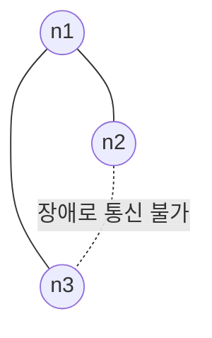
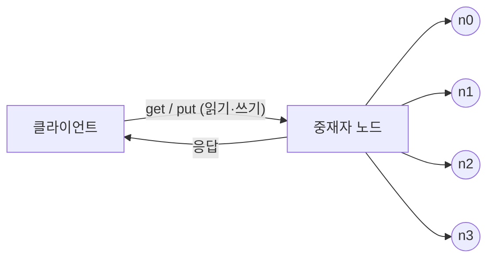
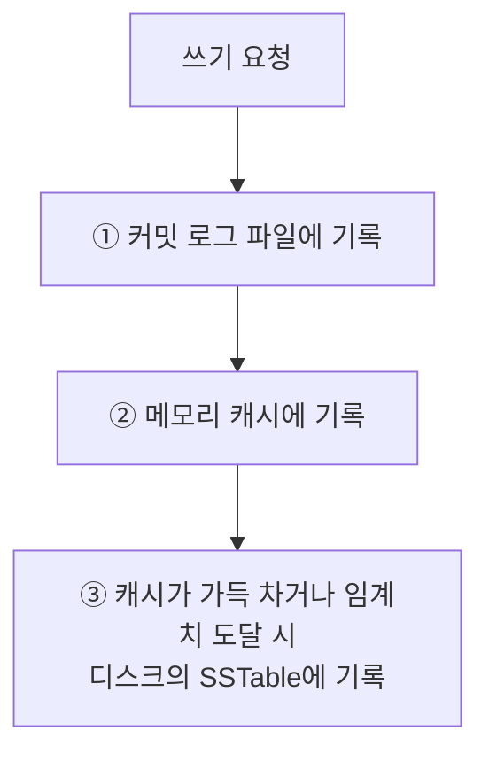

# 6장 키-값 저장소 설계

## 서론

키-값 저장소(key-value store)는 키와 값 사이의 관계를 통해서만 데이터에 접근하는 비관계형(non-relational) 데이터베이스다.

- 키는 유일 식별자(identifier)여야 하며, 짧을수록 성능상 유리하다.
- 키는 일반 텍스트일 수도 있고, 해시 값일 수도 있다. (예: `last_logged_in_at`, `253DDEC4`)
- 값은 문자열, 리스트, 객체 등 무엇이든 될 수 있고, 저장소는 값의 내용에 상관하지 않는다.

| 키 | 값 |
|---|---|
| 145 | john |
| 147 | bob |
| 160 | julia |

대표적인 사례로 아마존 다이나모(DynamoDB), memcached, 레디스(Redis)가 있다.

이 장에서 설계할 저장소가 지원해야 할 연산은 두 개뿐이다.

```text
put(key, value)  // 키-값 쌍을 저장소에 저장
get(key)         // 인자로 주어진 키에 매달린 값을 꺼냄
```

API는 두 줄이지만, 이 두 줄을 "수천 대 규모에서 장애가 나도" 지켜내는 것이 이 장의 전부다.


## 1. 문제 이해 및 설계 범위 확정

완벽한 설계란 없다. 읽기·쓰기·메모리 사용량 사이에 균형을 찾고, **일관성과 가용성 사이에서 타협적 결정**을 내린 설계가 좋은 답안이다.

이 장에서 만들 저장소의 요구사항은 다음과 같다.

- 키-값 쌍의 크기는 10KB 이하
- 큰 데이터를 저장할 수 있어야 함
- 높은 가용성 제공 (장애가 있어도 빨리 응답)
- 높은 규모 확장성 제공 (트래픽 양에 따라 서버 자동 증설/삭제)
- 데이터 일관성 수준은 조정 가능해야 함
- 응답 지연시간(latency)이 짧아야 함


## 2. 단일 서버 키-값 저장소

한 대 서버로 만드는 것은 쉽다. 가장 직관적인 방법은 키-값 쌍 전부를 **메모리에 해시 테이블로** 저장하는 것이다.

빠르지만 모든 데이터를 메모리에 두는 것이 불가능할 수 있다는 약점이 있다. 개선책은 두 가지다.

- 데이터 압축(compression)
- 자주 쓰이는 데이터만 메모리에 두고 나머지는 디스크에 저장

그러나 이렇게 개선해도 한 대로는 곧 부족해진다. → **분산 키-값 저장소**가 필요하다.


## 3. 분산 키-값 저장소와 CAP 정리

분산 키-값 저장소는 **분산 해시 테이블**이라고도 한다. 설계하려면 CAP 정리부터 이해해야 한다.

### CAP 정리

데이터 일관성(Consistency), 가용성(Availability), 파티션 감내(Partition tolerance) **세 가지를 동시에 만족하는 분산 시스템은 만들 수 없다**는 정리다.

- **데이터 일관성**: 어떤 노드에 접속했느냐에 관계없이 모든 클라이언트가 언제나 같은 데이터를 본다.
- **가용성**: 일부 노드에 장애가 발생해도 클라이언트는 항상 응답을 받는다.
- **파티션 감내**: 두 노드 사이에 통신 장애(파티션)가 생겨도 시스템은 계속 동작한다.

셋 중 **두 개를 고르면 나머지 하나는 반드시 희생**된다.

| 분류 | 지원 | 희생 |
|---|---|---|
| CP 시스템 | 일관성 + 파티션 감내 | 가용성 |
| AP 시스템 | 가용성 + 파티션 감내 | 데이터 일관성 |
| CA 시스템 | 일관성 + 가용성 | 파티션 감내 |

네트워크 장애는 피할 수 없는 일로 여겨지므로 분산 시스템은 반드시 파티션 문제를 감내하도록 설계되어야 한다. **그러므로 실세계에 CA 시스템은 존재하지 않는다.**

### 구체적 사례: 노드 n1, n2, n3



**이상적 상태**라면 네트워크가 파티션되는 상황은 절대 없고, n1에 기록된 데이터는 자동으로 n2와 n3에 복제되어 일관성과 가용성이 모두 만족된다.

**실세계**에서는 n3에 장애가 발생해 n1, n2와 통신할 수 없는 상황이 생긴다. 이때 선택해야 한다.

- **일관성을 선택(CP)**: 데이터 불일치를 피하기 위해 n1, n2에 대해 쓰기 연산을 중단시켜야 한다 → 가용성이 깨진다. 은행권 시스템이 대표적이다. 온라인 뱅킹이 계좌 최신 정보를 출력하지 못한다면 큰 문제이므로, 파티션이 해소될 때까지 오류를 반환한다.
- **가용성을 선택(AP)**: 낡은(out-of-date) 데이터를 반환할 위험이 있더라도 계속 읽기 연산을 허용하고, n1·n2는 계속 쓰기를 받는다. 파티션이 해소된 뒤 새 데이터를 n3에 전송한다.

> 면접에서는 요구사항에 맞도록 CAP 정리를 적용하고, 그 결론에 따라 시스템을 설계하는 흐름을 보여주면 된다.


## 4. 시스템 컴포넌트

키-값 저장소 구현에 사용될 핵심 컴포넌트와 기술은 다음과 같다. (다이나모, 카산드라, 빅테이블 사례 참고)

- 데이터 파티션
- 데이터 다중화(replication)
- 일관성(consistency)
- 일관성 불일치 해소(inconsistency resolution)
- 장애 처리
- 시스템 아키텍처 다이어그램
- 쓰기 경로(write path)
- 읽기 경로(read path)

### 4-1. 데이터 파티션

대규모 애플리케이션의 전체 데이터를 한 대에 욱여넣는 것은 불가능하다. 데이터를 작은 파티션으로 분할해 여러 서버에 저장해야 하며, 이때 두 가지가 중요하다.

- 데이터를 여러 서버에 **고르게** 분산할 수 있는가
- 노드가 추가/삭제될 때 데이터 **이동을 최소화**할 수 있는가

→ 5장의 **안정 해시(consistent hash)** 가 이 문제를 푸는 데 적합하다.

```text
1. 서버를 해시 링(hash ring)에 배치한다. (s0, s1, ... , s7)
2. 키를 같은 링 위에 배치하고, 그 지점부터 시계 방향으로 순회하다
   만나는 첫 번째 서버가 그 키-값 쌍을 저장할 서버다.
   → key0은 s1에 저장된다.
```

안정 해시로 파티션할 때의 이점은 두 가지다.

- **규모 확장 자동화(automatic scaling)**: 시스템 부하에 따라 서버가 자동으로 추가/삭제되도록 만들 수 있다.
- **다양성(heterogeneity)**: 서버 용량에 맞게 가상 노드(virtual node) 수를 조정할 수 있다. 고성능 서버는 더 많은 가상 노드를 갖게 한다.

### 4-2. 데이터 다중화

높은 가용성과 안정성을 위해 데이터를 **N개 서버에 비동기적으로 다중화**한다. (N은 튜닝 가능한 값)

어떤 키를 해시 링 위에 배치한 후, 그 지점으로부터 시계 방향으로 순회하면서 만나는 **첫 N개 서버**에 데이터 사본을 보관한다. N=3이면 key0은 s1, s2, s3에 저장된다.

주의할 점:

- 가상 노드를 쓰면 선택한 N개 노드가 대응될 **실제 물리 서버 개수가 N보다 작아질 수 있다.** → 노드를 선택할 때 같은 물리 서버를 중복 선택하지 않도록 해야 한다.
- 같은 데이터 센터에 속한 노드는 정전·네트워크 이슈·자연재해를 **동시에** 겪을 수 있다. → 사본은 다른 센터의 서버에 보관하고, 센터들은 고속 네트워크로 연결한다.

### 4-3. 데이터 일관성 - 정족수 합의(Quorum Consensus)

여러 노드에 다중화된 데이터는 적절히 동기화되어야 한다. 정족수 합의 프로토콜을 쓰면 읽기/쓰기 연산 모두에 일관성을 보장할 수 있다.

- **N** = 사본 개수
- **W** = 쓰기 연산에 대한 정족수. 쓰기가 성공하려면 적어도 W개 서버로부터 성공 응답을 받아야 한다.
- **R** = 읽기 연산에 대한 정족수. 읽기가 성공하려면 적어도 R개 서버로부터 응답을 받아야 한다.

W=1은 "한 대에만 기록한다"는 뜻이 **아니다.** 데이터가 s0, s1, s2에 다중화되는 상황에서 W=1은 쓰기 성공으로 판단하기 위해 **중재자(coordinator)가 최소 한 대로부터 성공 응답을 받아야 한다**는 뜻이다. 중재자는 클라이언트와 노드 사이에서 프락시(proxy) 역할을 한다.

W, R, N을 정하는 것은 **응답 지연과 데이터 일관성 사이의 타협점**을 찾는 전형적 과정이다.

- W=1 또는 R=1: 중재자는 한 대 응답만 받으면 되니 **빠르다**.
- W나 R이 1보다 크면: 일관성 수준은 올라가지만 **가장 느린 서버의 응답을 기다려야 하므로 느려진다**.
- **W + R > N**: 강한 일관성이 보장된다. 최신 데이터를 가진 노드가 최소 하나는 겹치기 때문이다.

가능한 구성 예:

| 구성 | 의미 |
|---|---|
| R=1, W=N | 빠른 읽기 연산에 최적화 |
| W=1, R=N | 빠른 쓰기 연산에 최적화 |
| W+R > N | 강한 일관성 보장 (보통 N=3, W=R=2) |
| W+R ≤ N | 강한 일관성 보장되지 않음 |

### 4-4. 일관성 모델

- **강한 일관성(strong consistency)**: 모든 읽기 연산은 가장 최근 갱신된 결과를 반환한다. 클라이언트는 절대 낡은 데이터를 보지 못한다.
- **약한 일관성(weak consistency)**: 읽기 연산이 최근 갱신 결과를 반환하지 못할 수 있다.
- **최종 일관성(eventual consistency)**: 약한 일관성의 한 형태로, 갱신 결과가 결국에는 모든 사본에 반영(동기화)되는 모델.

강한 일관성을 달성하는 일반적 방법은 **모든 사본에 현재 쓰기 결과가 반영될 때까지 해당 데이터에 대한 읽기/쓰기를 금지**하는 것이다. 새 요청 처리가 중단되므로 고가용성 시스템에는 부적합하다.

다이나모와 카산드라는 **최종 일관성 모델**을 택하며, 이 장의 설계도 이를 따른다. 최종 일관성에서는 쓰기 연산이 병렬로 발생하면 값의 일관성이 깨질 수 있는데, **이 문제는 클라이언트가 해결**해야 한다. → 버저닝이 등장한다.

### 4-5. 비일관성 해소 - 데이터 버저닝

다중화하면 가용성은 높아지지만 사본 간 일관성이 깨질 가능성도 높아진다.

**문제 상황**

```text
n1, n2에 "name: john"이 보관되어 있다.
서버1: put("name", "johnSanFrancisco")  → n1
서버2: put("name", "johnNewYork")       → n2
두 연산이 동시에 일어나면 v1, v2 두 값이 충돌(conflict)한다.
```

**버저닝(versioning)** 은 데이터를 변경할 때마다 새로운 버전을 만드는 것이다. 각 버전의 데이터는 변경 불가능(immutable)하다.

**벡터 시계(vector clock)** 는 `[서버, 버전]`의 순서쌍을 데이터에 매단 것으로, 어떤 버전이 선행/후행인지, 아니면 충돌인지 판별하는 데 쓰인다.

`D([S1, v1], [S2, v2], …, [Sn, vn])` — D는 데이터, vi는 버전 카운터, Si는 서버 번호.

데이터 D를 서버 Si에 기록하면:

- `[Si, vi]`가 있으면 vi를 증가시킨다.
- 그렇지 않으면 새 항목 `[Si, 1]`을 만든다.

**동작 예제**

```text
① 클라이언트가 D1을 기록. 처리 서버는 Sx        → D1([Sx, 1])
② 다른 클라이언트가 D1을 읽고 D2로 갱신. 같은 Sx가 처리 → D2([Sx, 2])
③ 또 다른 클라이언트가 D2를 읽어 D3으로 갱신. Sy가 처리  → D3([Sx, 2], [Sy, 1])
④ 또 다른 클라이언트가 D2를 읽고 D4로 갱신. Sz가 처리    → D4([Sx, 2], [Sz, 1])
⑤ 어떤 클라이언트가 D3과 D4를 읽으면 충돌을 발견한다.
   D2를 Sy와 Sz가 각각 다른 값으로 바꾸었기 때문이다.
   충돌을 클라이언트가 해소한 후 Sx가 기록하면 → D5([Sx, 3], [Sy, 1], [Sz, 1])
```

**충돌 판정 규칙**: 버전 Y의 벡터 시계 구성요소 가운데, 버전 X의 벡터 시계 동일 서버 구성요소보다 **작은 값을 갖는 것이 하나라도 있으면 충돌**이다. 모든 구성요소가 작거나 같으면 X는 Y의 이전 버전이다.

```text
D([s0, 1], [s1, 1])  vs  D([s0, 1], [s1, 2])  → 이전 버전 관계 (충돌 아님)
D([s0, 1], [s1, 2])  vs  D([s0, 2], [s1, 1])  → 충돌
```

**벡터 시계의 단점 두 가지**

1. 충돌 감지 및 해소 로직이 클라이언트에 들어가야 하므로 **클라이언트 구현이 복잡**해진다.
2. `[서버, 버전]` 순서쌍 개수가 **빨리 늘어난다.** 임계치(threshold)를 정해 오래된 순서쌍을 제거하면 되지만, 그러면 버전 간 선후 관계가 정확하게 결정될 수 없어 충돌 해소 효율이 낮아진다. 다만 아마존은 실제 서비스에서 그런 문제가 벌어지는 것을 발견한 적이 없다고 하니, 대부분의 기업에서 벡터 시계는 괜찮은 솔루션이다.


## 5. 장애 처리

대규모 시스템에서 장애는 불가피할 뿐 아니라 아주 흔하게 벌어지는 사건이다.

### 5-1. 장애 감지 - 가십 프로토콜

한 대 서버가 "지금 서버 A가 죽었습니다"라고 한다고 바로 장애 처리하지는 않는다. 보통 **두 대 이상의 서버가 똑같이 보고**해야 실제 장애로 간주한다.

모든 노드 사이에 **멀티캐스팅** 채널을 구축하는 것이 가장 손쉽지만, 서버가 많을 때는 비효율적이다. → **가십 프로토콜(gossip protocol)** 같은 분산형 장애 감지가 효율적이다.

```text
1. 각 노드는 멤버십 목록(membership list)을 유지한다.
   멤버십 목록은 각 멤버 ID와 그 박동 카운터(heartbeat counter) 쌍의 목록이다.
2. 각 노드는 주기적으로 자신의 박동 카운터를 증가시킨다.
3. 각 노드는 무작위로 선정된 노드들에게 주기적으로 자기 박동 카운터 목록을 보낸다.
4. 박동 카운터 목록을 받은 노드는 멤버십 목록을 최신 값으로 갱신한다.
5. 어떤 멤버의 박동 카운터 값이 지정된 시간 동안 갱신되지 않으면
   해당 멤버는 장애(offline) 상태인 것으로 간주한다.
```

예제: 노드 s0은 s2(멤버 ID=2)의 박동 카운터가 오랫동안 증가되지 않은 것을 발견하면, s2에 대한 정보를 무작위로 선택된 다른 노드들에게 전파한다. 여러 노드가 같은 사실을 확인하면 s2를 장애 노드로 표시한다.

### 5-2. 일시적 장애 처리 - 느슨한 정족수와 단서 후 임시 위탁

**엄격한 정족수(strict quorum)** 접근법을 쓴다면 장애 감지 시 읽기/쓰기 연산을 금지해야 한다.

**느슨한 정족수(sloppy quorum)** 는 이 조건을 완화해 가용성을 높인다. 정족수 요구사항을 강제하는 대신, **해시 링에서 건강한 서버 중 쓰기 연산을 수행할 W개, 읽기 연산을 수행할 R개를 고른다.** 장애 상태인 서버는 무시한다.

장애 상태 서버로 가는 요청은 **다른 서버가 잠시 맡아 처리**하고, 그동안 발생한 변경사항은 해당 서버가 복구되었을 때 일괄 반영해 일관성을 보존한다. 이를 위해 임시로 쓰기를 처리한 서버에 **단서(hint)** 를 남겨둔다. → **단서 후 임시 위탁(hinted handoff)**

> 예: 장애 상태인 노드 s2에 대한 읽기/쓰기를 일시적으로 s3이 처리한다. s2가 복구되면 s3은 갱신된 데이터를 s2로 인계한다.

### 5-3. 영구 장애 처리 - 반-엔트로피와 머클 트리

영구적인 노드 장애 상태는 **반-엔트로피(anti-entropy) 프로토콜**을 구현하여 사본들을 동기화한다. 반-엔트로피는 사본들을 비교하여 최신 버전으로 갱신하는 과정을 포함하며, 사본 간 일관성이 깨진 상태를 탐지하고 **전송 데이터 양을 줄이기 위해 머클(Merkle) 트리**를 사용한다.

> 해시 트리라고도 불리는 머클 트리는, 각 노드에 그 자식 노드들에 보관된 값의 해시(자식 노드가 종단 노드인 경우) 또는 자식 노드들의 레이블로부터 계산된 해시 값을 레이블로 붙여두는 트리다.

**머클 트리 만드는 과정** (키 공간이 1부터 12일 때)

```text
1단계: 키 공간을 버킷(bucket)으로 나눈다. (예: 4개 버킷)
2단계: 버킷에 포함된 각각의 키에 균등 분포 해시 함수를 적용해 해시 값을 계산한다.
3단계: 버킷별로 해시값을 계산한 후, 해당 해시 값을 레이블로 갖는 노드를 만든다.
4단계: 자식 노드의 레이블로부터 새로운 해시 값을 계산하여, 이진 트리를 상향식으로 구성한다.
```

**비교 방법**: 두 트리의 **루트 노드 해시값을 비교**한다. 같으면 두 서버는 같은 데이터를 갖는다. 다르면 왼쪽 자식 → 오른쪽 자식 순으로 내려가며 다른 데이터를 갖는 버킷을 찾고, **그 버킷들만 동기화**하면 된다.

동기화해야 하는 데이터 양은 **실제로 존재하는 차이의 크기에 비례**할 뿐, 두 서버에 보관된 데이터의 총량과는 무관해진다. 다만 실제 시스템에서는 버킷 하나의 크기가 꽤 크다. 예를 들어 10억(1B)개의 키를 100만(1M)개 버킷으로 관리하면 버킷 하나가 1,000개 키를 관리하게 된다.

### 5-4. 데이터 센터 장애 처리

정전, 네트워크 장애, 자연재해 등으로 데이터 센터 전체가 죽을 수 있다. 데이터를 **여러 데이터 센터에 다중화**해두면 한 센터가 완전히 망가져도 사용자는 다른 센터의 데이터를 이용할 수 있다.


## 6. 시스템 아키텍처 다이어그램



주요 기능:

- 클라이언트는 `get(key)`, `put(key, value)` 두 가지 단순한 API로 통신한다.
- **중재자(coordinator)** 는 클라이언트에게 키-값 저장소에 대한 프락시 역할을 하는 노드다.
- 노드는 안정 해시의 해시 링 위에 분포한다.
- 노드를 자동으로 추가/삭제할 수 있도록 시스템은 **완전히 분산(decentralized)** 된다.
- 데이터는 여러 노드에 다중화된다.
- **모든 노드가 같은 책임을 지므로 SPOF(Single Point of Failure)가 존재하지 않는다.**

완전히 분산된 설계이므로 모든 노드는 아래 기능 전부를 지원해야 한다.

```text
클라이언트 API | 장애 감지 | 데이터 충돌 해소 | 장애 복구 메커니즘
다중화        | 저장소 엔진 | ...
```

### 6-1. 쓰기 경로 (카산드라 사례)



- ① 쓰기 요청이 **커밋 로그(commit log)** 파일에 기록된다.
- ② 데이터가 **메모리 캐시**에 기록된다.
- ③ 메모리 캐시가 가득 차거나 사전 정의된 임계치에 도달하면 데이터는 디스크에 있는 **SSTable**에 기록된다.
  - SSTable은 **S**orted-**S**tring **Table**의 약어로, `<키, 값>` 순서쌍을 정렬된 리스트 형태로 관리하는 테이블이다.

### 6-2. 읽기 경로

**데이터가 메모리에 있는 경우** → 메모리 캐시에서 바로 결과를 반환한다.

**데이터가 메모리에 없는 경우** → 디스크에서 가져와야 하는데, 어느 SSTable에 키가 있는지 알아낼 효율적인 방법이 필요하다. 이 문제를 푸는 데는 **블룸 필터(Bloom filter)** 가 흔히 사용된다.

```text
① 데이터가 메모리에 있는지 검사한다. 없으면 ②로 간다.
② 데이터가 메모리에 없으므로 블룸 필터를 검사한다.
③ 블룸 필터를 통해 어떤 SSTable에 키가 보관되어 있는지 알아낸다.
④ SSTable에서 데이터를 가져온다.
⑤ 해당 데이터를 클라이언트에게 반환한다.
```


## 7. 요약

| 목표 / 문제 | 기술 |
|---|---|
| 대규모 데이터 저장 | 안정 해시를 사용해 서버들에 부하 분산 |
| 읽기 연산에 대한 높은 가용성 보장 | 데이터를 여러 데이터센터에 다중화 |
| 쓰기 연산에 대한 높은 가용성 보장 | 버저닝 및 벡터 시계를 사용한 충돌 해소 |
| 데이터 파티션 | 안정 해시 |
| 점진적 규모 확장성 | 안정 해시 |
| 다양성(heterogeneity) | 안정 해시 |
| 조정 가능한 데이터 일관성 | 정족수 합의(quorum consensus) |
| 일시적 장애 처리 | 느슨한 정족수(sloppy quorum)와 단서 후 임시 위탁(hinted handoff) |
| 영구적 장애 처리 | 머클 트리(Merkle tree) |
| 데이터 센터 장애 대응 | 여러 데이터 센터에 걸친 데이터 다중화 |


## 8. 마무리

키-값 저장소 설계의 핵심은 결국 **"어디까지 일관성을 포기하고 가용성을 살 것인가"** 를 결정하고, 그 결정에서 파생되는 문제들을 기술로 메우는 과정이다.

- CAP에서 P는 선택이 아니라 전제다. 실제 선택지는 **CP냐 AP냐** 뿐이다.
- AP(최종 일관성)를 택하면 충돌이 필연이므로 **버저닝·벡터 시계**로 충돌을 감지하고, 해소 책임은 클라이언트로 넘어간다.
- W, R, N은 **일관성과 지연시간의 다이얼**이다. `W + R > N`이면 강한 일관성, 보통은 N=3, W=R=2를 쓴다.
- 장애는 시간 축에 따라 다르게 처리한다. **일시적 장애 → 힌티드 핸드오프**, **영구적 장애 → 머클 트리 기반 반-엔트로피**, **센터 단위 장애 → 지역 간 다중화**.
- 저장소 엔진은 **커밋 로그 + 메모리 캐시 + SSTable + 블룸 필터**의 조합(LSM 트리 계열)으로, 쓰기를 순차 I/O로 바꾸고 읽기는 블룸 필터로 디스크 접근을 줄인다.


---

### 질문

- W+R > N이면 강한 일관성이 보장된다고 하는데, 왜 "최신 데이터를 가진 노드가 최소 하나는 겹친다"는 것만으로 충분할까? 겹친 노드 중 어느 것이 최신인지는 어떻게 판별할까?
- 벡터 시계의 순서쌍이 무한히 늘어나는 문제를 실무에서는 어떻게 다룰까? (다이나모의 임계치 vs 카산드라가 벡터 시계 대신 last-write-wins를 택한 이유)
- 느슨한 정족수는 가용성을 높이는 대신 어떤 일관성 위험을 감수하는 걸까?
- 블룸 필터는 false positive가 있는데, 그래도 읽기 경로에서 이득인 이유는?
