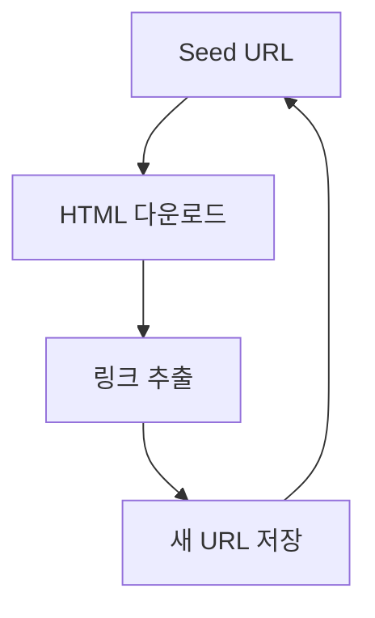
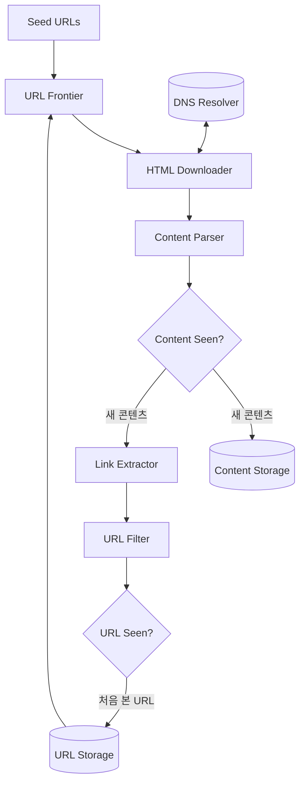
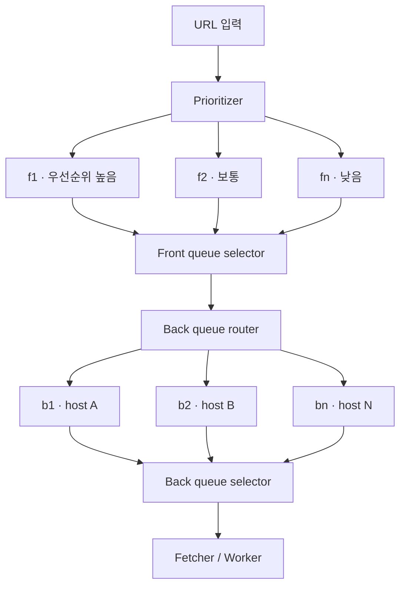

# 9장 웹크롤러 설계


## 서론

웹 크롤러는 "웹 페이지를 다운로드하는 프로그램"이 아니라, **우선순위 · 요청 제어 · 중복 제거 · 재시도 · 스케줄링**을 동시에 해결해야 하는 대규모 비동기 작업 처리 시스템이다. 

이 장에서 나온 Front Queue / Back Queue 구조는 크롤러를 넘어 Kafka·RabbitMQ·Redis Queue 같은 메시지 큐 설계 전반에 그대로 적용된다.


## 1. 가장 단순한 크롤러



원리는 단순하지만, 수십억 개의 URL을 다뤄야 하는 순간 "어떤 URL을 먼저?", "같은 사이트에 너무 많이 보내지 않으려면?", "이미 본 페이지는?", "실패하면?" 같은 문제가 한꺼번에 터진다.


## 2. 실제 아키텍처 



각 컴포넌트의 역할:

| 컴포넌트 | 하는 일 |
| --- | --- |
| **URL Frontier** | 수집할 URL을 관리하는 핵심 큐 (이 장의 주인공) |
| **HTML Downloader** | 실제 페이지를 받아옴 (DNS Resolver와 함께 동작) |
| **Content Parser** | 받은 HTML을 파싱·검증 |
| **Content Seen?** | 콘텐츠 해시로 중복 페이지 판별 |
| **Link Extractor** | 페이지 안의 링크를 뽑아냄 |
| **URL Filter** | 제외할 URL(차단 도메인, 확장자 등) 거름 |
| **URL Seen?** | 이미 큐에 넣은/방문한 URL인지 판별 |

> 결국 전체 구조는 **"받아서 → 저장하고 → 거기서 또 일감을 만들어 다시 큐에 넣는"** 순환 파이프라인이다.


## 3. URL Frontier는 저장소가 아니라 작업 큐다

처음엔 "방문할 URL 목록" 정도로 생각하기 쉽지만, 실제로는 크롤러 전체를 제어하는 컨트롤 타워다.

- URL 우선순위 관리
- 중복 URL 제거
- 재시도 관리
- 도메인별 요청 제한(rate limiting)
- 스케줄링

즉 단순 리스트가 아니라 **정책이 들어간 Job Queue**에 가깝다.


## 4. 핵심 설계 — Front Queue / Back Queue 2단 분리

이 장에서 가장 중요한 부분. URL Frontier 내부는 **두 단계의 큐**로 나뉜다.



### Front Queue — "무엇을 먼저 수집할 것인가"

- Prioritizer가 URL마다 우선순위를 매겨 우선순위별 큐(f1~fn)에 분배
- 변경 가능성이 높고 중요한 페이지일수록 먼저 처리
- 예) 뉴스: `속보 → 일반 기사 → 오래된 기사`

### Back Queue — "어떻게 / 언제 수집할 것인가"

- **Back Queue 하나당 호스트 하나**가 매핑됨
- 같은 사이트에 초당 수백 번 때리지 않도록 요청 간격을 제어 (politeness)
- 예) `naver.com → 1초 간격`, `example.com → 3초 간격`

### 왜 굳이 둘로 나눌까?

> **우선순위**와 **요청 제어**는 서로 다른 관심사이기 때문.

| | 결정하는 것 |
| --- | --- |
| Front Queue | 무엇을 먼저 처리할까 (priority) |
| Back Queue | 언제 처리할까 (politeness / rate limit) |

두 관심사를 분리하면 우선순위 정책과 rate limiting 정책을 **독립적으로** 바꿀 수 있다. (한쪽 정책을 바꿔도 다른 쪽이 안 흔들림)


## 5. 중복 제거 (Deduplication)

같은 페이지를 여러 번 방문하면 그대로 낭비다. 두 층위에서 제거한다.

**① URL 정규화 (Normalization)** — 사실상 같은 주소를 하나로

```text
?page=1
?page=01   →  같은 페이지
?page=1&
```

**② 콘텐츠 해시** — 주소는 달라도 내용이 같은 경우

```text
MD5 / SHA / SimHash
```

> SimHash는 "완전히 같은가"가 아니라 "거의 비슷한가"까지 잡아내서, 약간만 다른 중복 페이지도 걸러낸다. 실제 검색 엔진이 쓰는 방식.


## 6. Freshness — 언제 다시 수집할까 (Incremental Crawling)

모든 페이지를 같은 주기로 재수집하면 리소스 낭비. **변경 빈도에 따라 재방문 주기를 다르게** 가져간다.

| 콘텐츠 | 재수집 주기(예시) |
| --- | --- |
| 뉴스 기사 | 1시간 |
| 커뮤니티 게시글 | 6시간 |
| 개인 블로그 | 30일 |


## 7. 실무 매핑 — 결국 메시지 큐 설계와 같다

크롤러가 푸는 문제는 백엔드에서 Kafka / RabbitMQ / Redis Queue 쓸 때 만나는 문제와 거의 동일하다.

| 크롤러 개념 | 실무 대응 |
| --- | --- |
| URL Frontier | 메시지 큐 (Kafka / RabbitMQ / Redis) |
| Crawler Worker | Consumer |
| Front Queue | 우선순위 큐 / priority routing |
| Back Queue | Rate Limiter (호스트·테넌트별 throttling) |
| 중복 URL 제거 | Idempotency key |
| 재시도 Queue | Retry Queue / Dead Letter Queue |
| Freshness 주기 | 스케줄링 / 배치 재처리 |

> 평소에 쓰는 Redis 분산 락, idempotency key, 재시도 큐 패턴이 여기 그대로 들어있다. 크롤러를 이해한다는 건 결국 **"대규모 작업을 안전하게 처리하는 시스템을 어떻게 설계할까"**를 이해하는 것.


## 8. 실제 서비스 사례

### Google Search (Googlebot)
- 수십억 페이지를 **crawl budget**(사이트별 크롤링 할당량) 안에서 관리
- 페이지 중요도(링크 구조)와 변경 빈도로 우선순위·재방문 주기를 조정
- `robots.txt`를 존중하고, `sitemap.xml`로 크롤링 힌트를 받음
- → 책의 Front Queue(우선순위) + Freshness(재방문 주기)가 그대로 보이는 사례

### 네이버 검색 (Yeti 봇)
- 뉴스 · 블로그 · 카페 · 지식iN 등 **출처마다 특성이 달라** 수집 전략을 따로 운영
- 출처별로 변경 주기와 중요도가 다르니 재수집 정책도 다름
- → "데이터 종류별로 우선순위·주기를 분리"하는 게 Front Queue 발상과 동일

### 가격 비교 서비스 (네이버쇼핑 · 다나와 · 에누리)
- 쿠팡·11번가·G마켓 등의 상품 가격을 주기적으로 수집
- 여기서 1순위 문제는 **Rate Limiting** — 너무 자주 때리면 차단당함
- → Back Queue로 호스트별 요청 간격을 제어하는 전형적 상황

### Common Crawl
- 매월 수십억 페이지를 크롤링해 **공개 데이터셋**(WARC 포맷)으로 배포
- 대규모 분산 크롤러 + 중복 제거 + 저장 파이프라인의 실제 레퍼런스
- LLM 학습 데이터의 주요 출처 중 하나

### Internet Archive (Wayback Machine)
- 오픈소스 크롤러 **Heritrix**로 웹을 통째로 아카이빙
- 목적이 "검색"이 아니라 "보존"이라 우선순위·중복 제거 전략의 초점이 다름

### LLM 학습용 크롤러 (GPTBot · ClaudeBot · CCBot 등) — 최근 트렌드
- 모델 학습 데이터를 모으는 크롤러가 늘면서, 이를 `robots.txt`로 **차단하는 사이트가 급증**
- 저작권·라이선스·트래픽 비용 이슈가 겹치면서 "예의 있는 크롤링(politeness)"이 기술 문제를 넘어 정책·법률 문제로 확장되는 중


## 9. 참고 — 실제 기술 블로그 사례

> 국내 빅테크가 자사 크롤러 아키텍처를 상세히 공개한 글은 드묾(대부분 도구 비교/SaaS 홍보).
> 아래는 직접 구현해본 후기 + 운영 디테일이 풍부한 해설 위주로 추린 목록.


- **[Web Crawling at Scale — TonyWang (Medium 시리즈)](https://medium.com/@tonywangcn/web-crawling-at-scale-navigating-billions-of-urls-with-efficiency-7a9b9a1e3829)**
  BFS 순회 + Bloom 필터 중복 제거 + Redis 작업 큐 + MongoDB 저장 + Kafka 메시지 큐 조합. Golang exponential backoff 재시도. 기술 선택 이유까지 서술.

- **[Web Crawler System Design — grokkingthesystemdesign](https://grokkingthesystemdesign.com/guides/web-crawler-system-design/)**
  consistent hashing + 도메인 샤딩으로 수십억 URL 관리. 월 10억 페이지 × 500KB ≈ 월 500TB 추정. 정확 중복=암호화 해시 / 근접 중복=SimHash·MinHash / 대규모 멤버십=Bloom 필터.

- **[Design a Web Crawler — Hello Interview](https://www.hellointerview.com/learn/system-design/problem-breakdowns/web-crawler)**
  Kafka는 우선순위 소비 미지원 → 우선순위별 토픽 분리로 우회. RedisBloom `BF.ADD`/`BF.EXISTS`로 콘텐츠 dedup.

- **[Distributed Web Crawling — Bright Data](https://brightdata.com/blog/web-data/distributed-web-crawling)**
  10억 URL 기준 Bloom 필터 1.2GB vs Redis Set 12GB+ (메모리 90% 절약). robots.txt 검사는 워커 말고 URL frontier에 둘 것. Kafka/RabbitMQ/Celery 선택 기준, 도메인별 rate limit 수치.

- **[Bloom Filters — Arpit Bhayani](https://arpitbhayani.me/blogs/bloom-filters/)**
  Bloom 필터 기본 개념 → counting·deletable 변형 → 해시 함수 특성 → 실제 벤치마크까지.

> **연결 포인트**: 이 글들에서 반복되는 키워드(consistent hashing, Bloom filter, host 단위 파티셔닝, Kafka priority 토픽, 백오프 재시도)는 모두 8장 위쪽 "실무 매핑" 표와 1:1로 이어짐. 즉 책의 URL Frontier 설계 = 실제 분산 크롤러의 핵심 그대로.

--- 

### 질문

Q. Front Queue랑 Back Queue는 각각 무슨 문제를 담당해? 왜 굳이 둘로 나눴을까?

Q.크롤러의 URL Frontier, Worker, Back Queue, 중복 제거, 재시도 큐가 실무 메시지 큐 개념으로 치면 각각 뭐에 해당해?